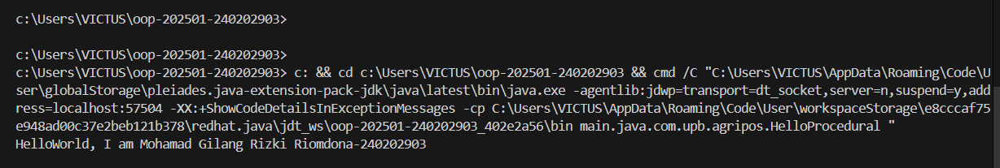

# Laporan Praktikum Minggu 1
Topik: "setup-hello-pos"

## Identitas
- Nama  : Mohamad Gilang Rizki Riomdona
- NIM   : 240202903
- Kelas : 3IKRB

---

## Tujuan
- Mahasiswa mampu mendefinisikan paradigma prosedural, OOP, dan fungsional.
- Mahasiswa mampu membandingkan kelebihan dan keterbatasan tiap paradigma.
- Mahasiswa mampu memberikan contoh program sederhana untuk masing-masing paradigma.
- Mahasiswa aktif dalam diskusi kelas (bertanya, menjawab, memberi opini).

---

## Dasar Teori
Paradigma pemrograman adalah cara pandang dalam menyusun program:

1. Prosedural: program dibangun sebagai rangkaian perintah (fungsi/prosedur).
2. OOP (Object-Oriented Programming): program dibangun dari objek yang memiliki data (atribut) dan perilaku (method).
3. Fungsional: program dipandang sebagai pemetaan fungsi matematika, lebih menekankan ekspresi dan transformasi data.
4. Dalam konteks Agri-POS, OOP membantu memodelkan entitas nyata seperti Produk, Transaksi, dan Pembayaran sebagai objek. Dengan  demikian, sistem lebih mudah dikembangkan dan dipelihara.

---

## Langkah Praktikum
1. Setup Project
- install JDK (Java Development Kit), IDE (misal: IntelliJ IDEA, VS Code, NetBeans), Git, PostgreSQL, dan JavaFX di komputer.
- Inisialisasi repositori Git.
- Inisialisasi repositori Git.
- Buat struktur awal src/main/java/com/upb/agripos/.
- Pastikan semua tools dapat berjalan (uji dengan membuat dan menjalankan program Java sederhana).
2. Program Sederhana dalam 3 Paradigma
- Prosedural: program untuk menghitung total harga dua produk.
- OOP: class Produk dengan atribut nama dan harga, buat minimal tiga objek, lalu hitung total.
- Fungsional: gunakan Stream atau lambda untuk menghitung total harga dari minimal tiga objek.
  
3. Commit dan Push
- Commit dengan pesan: week1-setup-hello-pos.

---

## Kode Program 

```java
// Paradigma Procedural
public class HelloProcedural {
   public HelloProcedural() {
   }

   public static void main(String[] var0) {
      String var1 = "240202903";
      String var2 = "Mohamad Gilang Rizki Riomdona";
      System.out.println("HelloWorld, I am " + var2 + "-" + var1);
   }
}

//Paradigma OOP
class Mahasiswa {
   String nama;
   String NIM;
   Mahasiswa(String nama, String NIM) {
      this.nama = nama;
      this.NIM = NIM;
   }
   void sapa(){ System.out.println("Hello World, I am" + " " + nama + "-" + NIM);}
}

public class HelloOOP {
   public static void main(String[] args) {
       Mahasiswa m = new Mahasiswa ("Mohamad Gilang Rizki Riomdona", "240202903");
       m.sapa();
   }
}

//Paradigma Functional
import java.util.function.BiConsumer;
public class HelloFunctional {
    public static void main(String[] args) {
        BiConsumer<String,String> sapa =
        (nama, NIM) -> System.out.println("Hello World, I am" + " " + nama + "-" + NIM);
        sapa.accept("Mohamad Gilang Rizki Riomdona", "240202903");
    }
}

```
---

## Hasil Eksekusi
(Sertakan screenshot hasil eksekusi program.  



)
---

## Analisis
(
- Jelaskan bagaimana kode berjalan.  
1. Paradigma Procedural
Pada program paradigma Procedural program berjalan secara berurutan dari atas ke bawah. Di dalam method main(), program menyimpan nama dan NIM ke dalam variabel, kemudian langsung mencetak hasilnya ke layar dengan perintah System.out.println(). Cara ini paling sederhana karena hanya berisi langkah-langkah yang dijalankan secara berurutan tanpa ada konsep objek atau fungsi terpisah.
2. Paradigma OOP
Pada paradigma OOP (Object-Oriented Programming), program dibangun berdasarkan objek. Di sini dibuat sebuah class bernama Mahasiswa yang memiliki dua atribut, yaitu nama dan NIM, serta satu method bernama sapa() untuk menampilkan pesan. Pada class HelloOOP, dibuat objek m dari class Mahasiswa, lalu method m.sapa() dipanggil untuk menampilkan hasilnya. Pendekatan ini lebih terstruktur karena memisahkan data dan perilaku ke dalam satu wadah yang disebut objek.

3. Paradigma Functional
pada paradigma functional, program menggunakan konsep fungsi sebagai data. Di sini digunakan BiConsumer, yaitu sebuah fungsi bawaan Java yang menerima dua nilai. Fungsi sapa didefinisikan menggunakan lambda expression (nama, NIM) -> ... dan dipanggil dengan sapa.accept(...). Pendekatan ini lebih ringkas karena fokus pada apa yang ingin dilakukan, bukan bagaimana langkah-langkahnya dilakukan.
- Apa perbedaan pendekatan minggu ini dibanding minggu sebelumnya.  
- Kendala yang dihadapi dan cara mengatasinya.  
)
---

## Kesimpulan
Kesimpulan dari praktikum minggu ini adalah bahwa setiap paradigma pemrograman memiliki cara kerja dan keunggulannya masing-masing. Pada paradigma prosedural, program disusun berdasarkan urutan langkah-langkah sehingga mudah dipahami untuk kasus sederhana. Pada paradigma berorientasi objek (OOP), penggunaan class dan object membuat program menjadi lebih terstruktur, rapi, dan mudah dikembangkan karena setiap bagian memiliki tanggung jawab yang jelas. Sementara itu, paradigma fungsional menawarkan cara penulisan yang lebih singkat dan efisien dengan memanfaatkan fungsi sebagai komponen utama. Dengan memahami ketiga paradigma ini, kita dapat memilih pendekatan yang paling sesuai untuk menyelesaikan suatu permasalahan pemrograman dengan lebih efektif dan terorganisir.

---

## Quiz
1. Apakah OOP selalu lebih baik dari prosedural?
   **Jawaban:Tidak selalu. OOP (Object-Oriented Programming) lebih baik digunakan ketika program kompleks dan membutuhkan struktur yang jelas antar objek, sedangkan paradigma prosedural bisa lebih efisien untuk program kecil dan sederhana karena lebih mudah diimplementasikan tanpa banyak abstraksi.**

2. Kapan functional programming lebih cocok digunakan dibanding OOP atau prosedural? 
   **Jawaban:Functional programming lebih cocok digunakan saat menangani masalah yang membutuhkan banyak operasi matematis, manipulasi data besar, atau proses paralel. Paradigma ini menghindari perubahan data (immutable) dan efek samping, sehingga lebih aman dan efisien dalam pemrosesan data berskala besar seperti pada aplikasi analisis data atau kecerdasan buatan.**

3. Bagaimana paradigma (prosedural, OOP, fungsional) memengaruhi maintainability dan scalability aplikasi? 
   **Jawaban:**
   **-Prosedural: Mudah dibuat, tapi sulit dipelihara jika program membesar karena kode bercampur tanpa struktur yang jelas.**
   **-OOP: Lebih mudah dimaintain dan scale up karena menggunakan konsep modularitas, enkapsulasi, dan pewarisan yang memudahkan   pengembangan dan perbaikan.**
   **-Fungsional: Meningkatkan maintainability karena fungsi bersifat independen dan bebas efek samping, namun bisa lebih sulit dipahami bagi pemula.** 

4. Mengapa OOP lebih cocok untuk mengembangkan aplikasi POS dibanding prosedural?
   **Jawaban:Karena aplikasi POS (Point of Sale) memiliki banyak entitas seperti produk, pelanggan, transaksi, dan kasir. Dengan OOP, setiap entitas dapat direpresentasikan sebagai objek dengan atribut dan perilaku masing-masing. Hal ini membuat sistem lebih terstruktur, mudah dikembangkan, serta mudah dikelola ketika ada perubahan fitur atau penambahan modul baru.**

5. Bagaimana paradigma fungsional dapat membantu mengurangi kode berulang (boilerplate code)?
   **Jawaban:Functional programming mendorong penggunaan fungsi-fungsi kecil yang dapat digunakan kembali (reusable) dan mendukung konsep higher-order function serta lambda expression. Dengan cara ini, banyak pola kode berulang dapat digantikan oleh fungsi generik, sehingga kode menjadi lebih singkat, bersih, dan mudah dibaca.**
