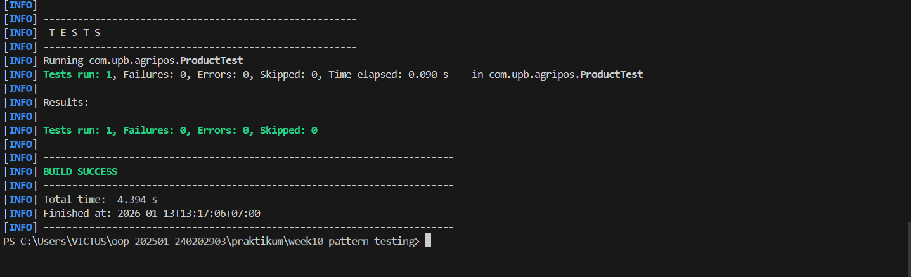

# Bab 10 – Design Pattern (Singleton, MVC) dan Unit Testing menggunakan JUnit
Topik: [Design Pattern (Singleton, MVC) dan Unit Testing menggunakan JUnit]

## Identitas
- Nama  : [Mohamad Gilang Rizki Riomdona]
- NIM   : [240202903]
- Kelas : [3 IKRB]

---

## Tujuan
(Setelah mengikuti praktikum ini, mahasiswa mampu:

1. Menjelaskan konsep dasar design pattern dalam rekayasa perangkat lunak.
2. Mengimplementasikan Singleton Pattern dengan benar.
3. Menjelaskan dan menerapkan Model–View–Controller (MVC) pada aplikasi sederhana.
4. Membuat dan menjalankan unit test menggunakan JUnit.
5. Menganalisis manfaat penerapan design pattern dan unit testing terhadap kualitas perangkat lunak.)

---

## Dasar Teori
(Tuliskan ringkasan teori singkat (3–5 poin) yang mendasari praktikum.  
Contoh:  
1. Class adalah blueprint dari objek.  
2. Object adalah instansiasi dari class.  
3. Enkapsulasi digunakan untuk menyembunyikan data.)

---

## Langkah Praktikum
(### 1. Design Pattern

Design pattern adalah solusi desain yang telah teruji untuk menyelesaikan masalah umum dalam pengembangan perangkat lunak. Fokus minggu ini:
- Singleton Pattern
- MVC (Model–View–Controller)

### 2. Singleton Pattern

Tujuan: Menjamin suatu class hanya memiliki satu instance dan menyediakan titik akses global.

Karakteristik:
- Constructor `private`
- Atribut `static instance`
- Method `static getInstance()`

Contoh Implementasi:
```java
package com.upb.agripos.config;

public class DatabaseConnection {
    private static DatabaseConnection instance;
    private DatabaseConnection() {}

    public static DatabaseConnection getInstance() {
        if (instance == null) {
            instance = new DatabaseConnection();
        }
        return instance;
    }
}
```

Penerapan pada Agri-POS: koneksi database atau service global yang tidak boleh lebih dari satu instance.

### 3. MVC (Model–View–Controller)

Memisahkan tanggung jawab aplikasi:

| Komponen | Tanggung Jawab |
|---------|------------------|
| Model   | Data dan logika bisnis |
| View    | Tampilan/output |
| Controller | Penghubung Model dan View |

Contoh Struktur MVC Sederhana:
- Model → `Product`
- View → `ConsoleView`
- Controller → `ProductController`

---)

---

## Kode Program
(

```java
// DatabaseConnection.java
package src.main.java.com.upb.agripos.config;

public class DatabaseConnection {
    private static DatabaseConnection instance;

    // constructor private
    private DatabaseConnection() {
        System.out.println("Database Connected");
    }

    // method global access
    public static DatabaseConnection getInstance() {
        if (instance == null) {
            instance = new DatabaseConnection();
        }
        return instance;
    }
}

//Productontroller.java
package com.upb.agripos.controller;

import com.upb.agripos.model.Product;
import com.upb.agripos.view.ConsoleView;

public class ProductController {
    private final Product model;
    private final ConsoleView view;

    public ProductController(Product model, ConsoleView view) {
        this.model = model;
        this.view = view;
    }

    public void showProduct() {
        view.showMessage(
            "Produk: " + model.getCode() + " - " + model.getName()
        );
    }
}

//Product.java
package com.upb.agripos.model;

public class Product {

    private final String code;
    private final String name;

    public Product(String code, String name) {
        this.code = code;
        this.name = name;
    }

    public String getCode() {
        return code;
    }

    public String getName() {
        return name;
    }
}

//ConsoleView.java
package com.upb.agripos.view;

public class ConsoleView {
    
    public void showMessage(String message) {
        System.out.println(message);
    }
}

//AppMVC.java
package com.upb.agripos;

import com.upb.agripos.config.DatabaseConnection;
import com.upb.agripos.controller.ProductController;
import com.upb.agripos.model.Product;
import com.upb.agripos.view.ConsoleView;

public class AppMVC {

    public static void main(String[] args) {

        System.out.println(
            "Hello, I am Mohamad Gilang Rizki Riomdona-240202903 (Week10)"
        );

        // Singleton dipanggil
        DatabaseConnection db = DatabaseConnection.getInstance();

        Product product = new Product("P01", "Pupuk Organik");
        ConsoleView view = new ConsoleView();
        ProductController controller =
                new ProductController(product, view);

        controller.showProduct();
    }
}

//ProductTest.java
package com.upb.agripos; // Sudah diperbaiki

import static org.junit.jupiter.api.Assertions.assertEquals;
import org.junit.jupiter.api.Test;

import com.upb.agripos.model.Product;

public class ProductTest {

    @Test
    public void testProductName() {
        Product product = new Product("P01", "Benih Jagung");
        assertEquals("Benih Jagung", product.getName());
    }
  
}
```
)
---

## Hasil Eksekusi
(Sertakan screenshot hasil eksekusi program.  

)
---

## Analisis
(
- Jelaskan bagaimana kode berjalan.  
    Program menerapkan dua konsep utama, yaitu Singleton Pattern dan Model–View–Controller (MVC), serta dilengkapi dengan unit testing menggunakan JUnit.

    Eksekusi program dimulai dari kelas AppMVC yang memiliki method main(). Saat program dijalankan, aplikasi pertama kali menampilkan pesan identitas mahasiswa pada console sebagai penanda eksekusi program. Selanjutnya, program memanggil method getInstance() dari kelas DatabaseConnection. Kelas ini menerapkan Singleton Pattern, di mana konstruktor dibuat private sehingga objek tidak dapat dibuat secara langsung. Method getInstance() memastikan bahwa hanya satu instance DatabaseConnection yang dibuat dan digunakan selama aplikasi berjalan. Ketika instance pertama kali dibuat, program menampilkan pesan “Database Connected”.

    Setelah koneksi database terbentuk, program melanjutkan ke penerapan arsitektur MVC. Pada bagian Model, kelas Product digunakan untuk menyimpan data produk berupa kode dan nama produk. Objek Product dibuat dengan nilai "P01" sebagai kode dan "Pupuk Organik" sebagai nama produk. Data ini bersifat immutable karena atributnya bertipe final.

    Pada bagian View, kelas ConsoleView bertugas menampilkan informasi ke layar menggunakan method showMessage(). View tidak memiliki logika bisnis dan hanya berfungsi sebagai media output.

    Selanjutnya, pada bagian Controller, kelas ProductController berperan sebagai penghubung antara Model dan View. Controller menerima objek Product dan ConsoleView melalui constructor. Ketika method showProduct() dipanggil, controller mengambil data dari model menggunakan getter (getCode() dan getName()), lalu meneruskannya ke view untuk ditampilkan ke console.

    Alur MVC ini memastikan pemisahan tanggung jawab antara penyimpanan data, tampilan, dan logika aplikasi sehingga kode lebih terstruktur dan mudah dikembangkan.

    Selain itu, program dilengkapi dengan unit testing melalui kelas ProductTest menggunakan framework JUnit 5. Pada method testProductName(), objek Product dibuat dengan nama "Benih Jagung". Pengujian dilakukan menggunakan assertEquals() untuk memastikan bahwa method getName() mengembalikan nilai yang sesuai. Jika hasil sesuai dengan yang diharapkan, maka pengujian dinyatakan berhasil.

    Secara keseluruhan, program berjalan dengan alur yang terstruktur: Singleton memastikan hanya satu koneksi database, MVC memisahkan logika aplikasi, dan unit testing memastikan bahwa fungsi pada model berjalan dengan benar.


- Apa perbedaan pendekatan minggu ini dibanding minggu sebelumnya.
    Pendekatan pemrograman pada Week 9 dan Week 10 memiliki fokus yang berbeda sesuai dengan tujuan pembelajaran masing-masing minggu.

    Pada Week 9, pendekatan yang digunakan berfokus pada Exception Handling. Program dirancang untuk menangani berbagai kondisi kesalahan yang mungkin terjadi selama proses eksekusi aplikasi, seperti jumlah pembelian yang tidak valid, produk yang tidak ditemukan dalam keranjang, dan stok produk yang tidak mencukupi. Untuk itu, dibuat beberapa custom exception seperti InvalidQuantityException, ProductNotFoundException, dan InsufficientStockException. Alur program bersifat prosedural dan terpusat pada pengujian skenario error menggunakan blok try-catch di dalam method main(). Tujuan utama pendekatan ini adalah memastikan program tetap berjalan dengan aman dan memberikan pesan kesalahan yang jelas ketika terjadi kondisi yang tidak valid.

    Sebaliknya, pada Week 10, pendekatan program lebih menekankan pada struktur dan arsitektur aplikasi. Program menerapkan Design Pattern, yaitu Singleton Pattern untuk manajemen koneksi database dan Model–View–Controller (MVC) untuk memisahkan tanggung jawab antara data, logika, dan tampilan. Selain itu, Week 10 juga menambahkan unit testing menggunakan JUnit untuk memastikan bahwa setiap komponen (khususnya model) berjalan sesuai dengan yang diharapkan. Pendekatan ini membuat kode lebih modular, mudah dipelihara, dan siap dikembangkan menjadi aplikasi berskala lebih besar.

    Secara ringkas, Week 9 berfokus pada penanganan kesalahan saat runtime, sedangkan Week 10 berfokus pada desain arsitektur, pola desain, dan kualitas kode melalui pengujian. Kedua pendekatan ini saling melengkapi, di mana Week 9 memastikan program aman dari error, dan Week 10 memastikan program tersusun rapi, terstruktur, serta mudah diuji.  

- Kendala yang dihadapi dan cara mengatasinya.  
    Selama pengerjaan praktikum Week 10, terdapat beberapa kendala yang dialami baik dari sisi konfigurasi lingkungan maupun implementasi program. Kendala utama yang dihadapi adalah error Maven yang menyatakan bahwa variabel lingkungan JAVA_HOME tidak terdefinisi dengan benar. Meskipun Java sudah terinstal dan perintah java --version dapat dijalankan, Maven tetap gagal dieksekusi karena membutuhkan variabel JAVA_HOME untuk menentukan lokasi JDK yang digunakan.

    Untuk mengatasi masalah tersebut, dilakukan pengecekan dan pengaturan ulang variabel lingkungan JAVA_HOME agar menunjuk langsung ke direktori instalasi JDK yang valid. Selain itu, variabel PATH juga diperbarui agar menyertakan folder bin dari JDK. Setelah konfigurasi dilakukan dengan benar, perintah mvn -v dan mvn clean compile dapat dijalankan tanpa error, sehingga proses build proyek Maven berhasil.

    Kendala berikutnya adalah proyek Maven tidak langsung terdeteksi oleh Visual Studio Code, sehingga struktur proyek dan dependensi tidak muncul secara otomatis. Masalah ini diatasi dengan memastikan bahwa folder yang dibuka adalah root project Maven (folder yang berisi file pom.xml) serta menggunakan fitur reload/refresh Maven project pada ekstensi Java di VS Code. Setelah proyek berhasil diimpor, dependensi dapat dikenali dan program dapat dijalankan dengan normal.

    Selain itu, terdapat juga kendala dalam penyesuaian struktur package dan path direktori, terutama saat memisahkan komponen sesuai pola MVC. Kendala ini diatasi dengan menyamakan nama package pada setiap file Java dengan struktur folder proyek, sehingga tidak terjadi error saat proses kompilasi.

    Dengan mengatasi kendala-kendala tersebut, aplikasi dapat dijalankan dengan baik dan tujuan praktikum Week 10, yaitu penerapan Design Pattern (Singleton dan MVC) serta unit testing menggunakan JUnit, dapat tercapai dengan optimal.
)
---

## Kesimpulan
(Dengan menerapkan Design Pattern Singleton dan MVC (Model–View–Controller), program menjadi lebih terstruktur, terorganisir, dan mudah dikembangkan. Pemisahan tanggung jawab antara model, tampilan, dan controller membuat kode lebih mudah dipahami serta dipelihara. Selain itu, penggunaan unit testing dengan JUnit membantu memastikan bahwa fungsi program berjalan sesuai dengan yang diharapkan. Secara keseluruhan, penerapan design pattern pada praktikum ini meningkatkan kualitas desain perangkat lunak dan kesiapan aplikasi untuk dikembangkan lebih lanjut.)

---

## Quiz
(1. [Mengapa constructor pada Singleton harus bersifat private?]  
   **Jawaban:** Constructor pada Singleton harus bersifat private agar objek tidak bisa dibuat secara langsung dari luar class menggunakan new. Dengan begitu, pembuatan objek hanya bisa dilakukan melalui method getInstance(), sehingga menjamin hanya ada satu instance dari class tersebut selama program berjalan.  

2. [Jelaskan manfaat pemisahan Model, View, dan Controller.]  
   **Jawaban:** Pemisahan Model, View, dan Controller (MVC) membuat program menjadi lebih terstruktur dan modular.
                    -Model menangani data dan logika bisnis
                    -View bertugas menampilkan data
                    -Controller menghubungkan Model dan View
                Dengan pemisahan ini, kode lebih mudah dipahami, dirawat, diuji, dan dikembangkan tanpa saling memengaruhi bagian lain.  

3. [Apa peran unit testing dalam menjaga kualitas perangkat lunak?]  
   **Jawaban:** Unit testing berperan untuk menguji fungsi atau class secara terpisah agar berjalan sesuai dengan yang diharapkan. Dengan unit testing, kesalahan dapat ditemukan lebih awal, perubahan kode lebih aman dilakukan, dan kualitas perangkat lunak tetap terjaga.  

4. [Apa risiko jika Singleton tidak diimplementasikan dengan benar?]  
   **Jawaban:** Jika Singleton tidak diimplementasikan dengan benar, bisa terjadi lebih dari satu instance objek, yang menyebabkan inkonsistensi data, pemborosan memori, dan potensi bug, terutama pada aplikasi yang menggunakan resource bersama seperti koneksi database. )
