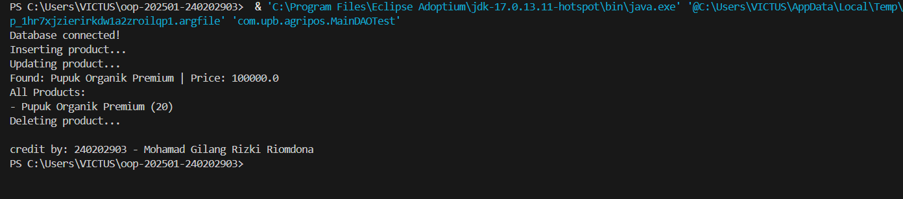

# Laporan Praktikum Minggu 10
Topik: Design Pattern (Singleton, MVC) dan Unit Testing menggunakan JUnit

## Identitas
- Nama  : [Mohamad Gilang Rizki Riomdona]
- NIM   : [240202903]
- Kelas : [3 IKRB]

---

## Tujuan
(
## Tujuan Pembelajaran (Sub-CPMK04)

Setelah mengikuti praktikum ini, mahasiswa mampu:

1. Menjelaskan konsep dasar design pattern dalam rekayasa perangkat lunak.
2. Mengimplementasikan Singleton Pattern dengan benar.
3. Menjelaskan dan menerapkan Model–View–Controller (MVC) pada aplikasi sederhana.
4. Membuat dan menjalankan unit test menggunakan JUnit.
5. Menganalisis manfaat penerapan design pattern dan unit testing terhadap kualitas perangkat lunak.)

---

## Dasar Teori
(
### 1. Design Pattern

Design pattern adalah solusi desain yang telah teruji untuk menyelesaikan masalah umum dalam pengembangan perangkat lunak. Fokus minggu ini:
- Singleton Pattern
- MVC (Model–View–Controller)

### 2. Singleton Pattern

Tujuan: Menjamin suatu class hanya memiliki satu instance dan menyediakan titik akses global.

Karakteristik:
- Constructor `private`
- Atribut `static instance`
- Method `static getInstance()`

Contoh Implementasi:
```java
package com.upb.agripos.config;

public class DatabaseConnection {
    private static DatabaseConnection instance;
    private DatabaseConnection() {}

    public static DatabaseConnection getInstance() {
        if (instance == null) {
            instance = new DatabaseConnection();
        }
        return instance;
    }
}
```

Penerapan pada Agri-POS: koneksi database atau service global yang tidak boleh lebih dari satu instance.

### 3. MVC (Model–View–Controller)

Memisahkan tanggung jawab aplikasi:

| Komponen | Tanggung Jawab |
|---------|------------------|
| Model   | Data dan logika bisnis |
| View    | Tampilan/output |
| Controller | Penghubung Model dan View |

Contoh Struktur MVC Sederhana:
- Model → `Product`
- View → `ConsoleView`
- Controller → `ProductController)

---

## Langkah Praktikum
(
## Langkah Praktikum Pertemuan 10

1. Implementasikan Singleton untuk `DatabaseConnection`.
2. Buat struktur MVC sederhana untuk fitur Product.
3. Buat minimal 1 unit test JUnit.
4. Jalankan unit test dan dokumentasikan hasilnya.

Commit message:
```
week10-pattern-testing: [fitur] [deskripsi singkat]
```

)

---

## Kode Program
(Tuliskan kode utama yang dibuat, contoh:  

```java
// Product.java
package com.upb.agripos.dao;

public class Product {

    private String code;
    private String name;
    private double price;
    private int stock;

    public Product(String code, String name, double price, int stock) {
        this.code = code;
        this.name = name;
        this.price = price;
        this.stock = stock;
    }

    public String getCode() { return code; }
    public String getName() { return name; }
    public double getPrice() { return price; }
    public int getStock() { return stock; }

    public void setName(String name) { this.name = name; }
    public void setPrice(double price) { this.price = price; }
    public void setStock(int stock) { this.stock = stock; }
}

//productDAO.java
package com.upb.agripos.model;

import java.util.List;

import com.upb.agripos.dao.Product;

public interface ProductDAO {
    void insert(Product product) throws Exception;
    void update(Product product) throws Exception;
    Product findByCode(String code) throws Exception;
    List<Product> findAll() throws Exception;
    void delete(String code) throws Exception;
}

//ProductDAOImpl.java
package com.upb.agripos.model;

import java.sql.Connection;
import java.sql.PreparedStatement;
import java.sql.ResultSet;
import java.util.ArrayList;
import java.util.List;

import com.upb.agripos.dao.Product;

public class ProductDAOImpl implements ProductDAO {

    private final Connection connection;

    public ProductDAOImpl(Connection connection) {
        this.connection = connection;
    }

    @Override
    public void insert(Product p) throws Exception {
        String sql = "INSERT INTO products(code, name, price, stock) VALUES (?, ?, ?, ?)";
        try (PreparedStatement ps = connection.prepareStatement(sql)) {
            ps.setString(1, p.getCode());
            ps.setString(2, p.getName());
            ps.setDouble(3, p.getPrice());
            ps.setInt(4, p.getStock());
            ps.executeUpdate();
        }
    }

    @Override
    public void update(Product p) throws Exception {
        String sql = "UPDATE products SET name=?, price=?, stock=? WHERE code=?";
        try (PreparedStatement ps = connection.prepareStatement(sql)) {
            ps.setString(1, p.getName());
            ps.setDouble(2, p.getPrice());
            ps.setInt(3, p.getStock());
            ps.setString(4, p.getCode());
            ps.executeUpdate();
        }
    }

    @Override
    public Product findByCode(String code) throws Exception {
        String sql = "SELECT * FROM products WHERE code=?";
        try (PreparedStatement ps = connection.prepareStatement(sql)) {
            ps.setString(1, code);
            ResultSet rs = ps.executeQuery();
            if (rs.next()) {
                return new Product(
                    rs.getString("code"),
                    rs.getString("name"),
                    rs.getDouble("price"),
                    rs.getInt("stock")
                );
            }
        }
        return null;
    }

    @Override
    public List<Product> findAll() throws Exception {
        List<Product> list = new ArrayList<>();
        String sql = "SELECT * FROM products";
        try (PreparedStatement ps = connection.prepareStatement(sql);
             ResultSet rs = ps.executeQuery()) {

            while (rs.next()) {
                list.add(new Product(
                    rs.getString("code"),
                    rs.getString("name"),
                    rs.getDouble("price"),
                    rs.getInt("stock")
                ));
            }
        }
        return list;
    }

    @Override
    public void delete(String code) throws Exception {
        String sql = "DELETE FROM products WHERE code=?";
        try (PreparedStatement ps = connection.prepareStatement(sql)) {
            ps.setString(1, code);
            ps.executeUpdate();
        }
    }
}

//MainDAOTest.java
package com.upb.agripos;

import java.sql.Connection;
import java.sql.DriverManager;
import java.util.List;

import com.upb.agripos.dao.Product;
import com.upb.agripos.model.ProductDAO;
import com.upb.agripos.model.ProductDAOImpl;

public class MainDAOTest {

    public static void main(String[] args) {

        try {
            Connection conn = DriverManager.getConnection(
                "jdbc:postgresql://localhost:5432/agripos",
                "postgres",
                "071005"
            );

            System.out.println("Database connected!");

            ProductDAO dao = new ProductDAOImpl(conn);

            // CREATE
            System.out.println("Inserting product...");
            dao.insert(new Product("P01", "Pupuk Organik", 25000, 10));

            // UPDATE
            System.out.println("Updating product...");
            dao.update(new Product("P01", "Pupuk Organik Premium", 100000, 20));

            // READ (BY CODE)
            Product p = dao.findByCode("P01");
            System.out.println(
                "Found: " + p.getName() + " | Price: " + p.getPrice()
            );

            // READ (ALL)
            System.out.println("All Products:");
            List<Product> products = dao.findAll();
            for (Product pr : products) {
                System.out.println("- " + pr.getName() + " (" + pr.getStock() + ")");
            }

            // DELETE
            System.out.println("Deleting product...");
            dao.delete("P01");

            conn.close();

            System.out.println("\ncredit by: 240202903 - Mohamad Gilang Rizki Riomdona");

        } catch (Exception e) {
            e.printStackTrace();
        }
    }
}

```
)
---

## Hasil Eksekusi
(Sertakan screenshot hasil eksekusi program.  

)
---

## Analisis
(
- Jelaskan bagaimana kode berjalan.  
   Program ini dijalankan melalui class MainDAOTest yang berfungsi sebagai pengendali alur aplikasi. Saat program dijalankan, langkah pertama yang dilakukan adalah membuat koneksi ke database PostgreSQL menggunakan DriverManager. Jika koneksi berhasil, aplikasi menampilkan pesan bahwa database telah terhubung. Koneksi ini kemudian diberikan ke objek DAO agar seluruh operasi terhadap database dilakukan melalui satu jalur yang terstruktur.

   Setelah koneksi terbentuk, program membuat objek ProductDAO dengan menggunakan class ProductDAOImpl. Class ini bertugas menangani seluruh proses akses data, sehingga class utama tidak berhubungan langsung dengan perintah SQL. Dengan cara ini, logika bisnis dan logika akses data dipisahkan sesuai dengan konsep Data Access Object (DAO).

   Selanjutnya, program melakukan operasi Create dengan menambahkan data produk baru ke dalam tabel products. Data produk dikirim dalam bentuk objek Product dan disimpan ke database menggunakan PreparedStatement. Setelah itu, program menjalankan operasi Update untuk memperbarui data produk yang sama, seperti nama, harga, dan stok, berdasarkan kode produk.

   Program kemudian menjalankan operasi Read dengan mengambil data produk berdasarkan kode tertentu. Data yang ditemukan dikembalikan dalam bentuk objek Product dan ditampilkan ke layar. Selain itu, program juga mengambil seluruh data produk yang tersimpan di database menggunakan operasi Read All, lalu menampilkannya satu per satu.

   Terakhir, program menjalankan operasi Delete untuk menghapus data produk dari database berdasarkan kode produk. Setelah seluruh proses CRUD selesai dijalankan, koneksi database ditutup untuk menghindari penggunaan resource yang berlebihan. Dengan alur ini, program berhasil menerapkan konsep DAO dan operasi CRUD secara lengkap menggunakan JDBC dan PostgreSQL.

- Apa perbedaan pendekatan minggu ini dibanding minggu sebelumnya.  
   Pendekatan pada minggu ini (Week 11) berbeda dengan minggu sebelumnya (Week 10) terutama pada cara pengelolaan data dan arsitektur aplikasi. Pada Week 10, aplikasi masih menggunakan pendekatan MVC dan Singleton tanpa terhubung langsung ke database. Data produk disimpan dan dikelola secara statis melalui objek Product, sementara class DatabaseConnection hanya berfungsi sebagai simulasi koneksi database untuk menerapkan pola Singleton, bukan sebagai penghubung ke database yang sebenarnya. Fokus utama pada minggu tersebut adalah memahami pemisahan peran antara Model, View, dan Controller serta penerapan design pattern dalam struktur aplikasi.

   Sementara itu, pada Week 11 pendekatan aplikasi dikembangkan lebih lanjut dengan menerapkan Data Access Object (DAO) dan koneksi database nyata menggunakan JDBC. Data produk tidak lagi disimpan secara statis di dalam objek, melainkan diambil dan disimpan langsung ke dalam database PostgreSQL melalui operasi CRUD (Create, Read, Update, Delete). Class DAO bertugas menangani seluruh interaksi dengan database, sedangkan class utama hanya berperan sebagai pengendali alur program. Dengan pendekatan ini, aplikasi menjadi lebih realistis, terstruktur, dan siap dikembangkan lebih lanjut karena logika akses data dipisahkan dari logika bisnis sesuai prinsip OOP.

- Kendala yang dihadapi dan cara mengatasinya.  
   Selama pengerjaan praktikum ini, kendala utama yang dihadapi adalah kesalahan pada pengaturan package dan struktur direktori proyek, sehingga banyak class tidak dapat dikenali dan menyebabkan error kompilasi. Masalah ini diatasi dengan menyesuaikan kembali nama package agar sesuai dengan struktur folder standar Maven, yaitu menggunakan src/main/java sebagai root source dan memastikan setiap file Java memiliki deklarasi package yang konsisten. Selain itu, sempat terjadi kendala pada koneksi database berupa pesan No suitable driver found, yang disebabkan oleh belum ditambahkannya driver PostgreSQL pada file pom.xml. Kendala ini berhasil diatasi dengan menambahkan dependency PostgreSQL JDBC dan melakukan reload Maven sehingga driver dapat dikenali oleh aplikasi. Setelah struktur proyek, konfigurasi Maven, dan dependency diperbaiki, program dapat dijalankan dengan baik dan seluruh operasi CRUD berhasil dieksekusi sesuai dengan yang diharapkan.
)
---

## Kesimpulan
(Berdasarkan hasil praktikum minggu ini, dapat disimpulkan bahwa penerapan Data Access Object (DAO) dan JDBC dalam aplikasi Java memungkinkan pengelolaan data menjadi lebih terstruktur, terpisah, dan mudah dikembangkan. Dengan memisahkan logika akses database ke dalam class DAO, kode program menjadi lebih rapi, mudah dipelihara, serta sesuai dengan prinsip pemrograman berorientasi objek. Selain itu, implementasi operasi CRUD (Create, Read, Update, Delete) menggunakan database PostgreSQL menunjukkan bahwa aplikasi dapat berinteraksi dengan basis data secara nyata dan efisien. Praktikum ini membantu memahami bagaimana integrasi antara aplikasi Java dan database dilakukan secara profesional serta menjadi dasar penting dalam pengembangan aplikasi berskala lebih besar.)
