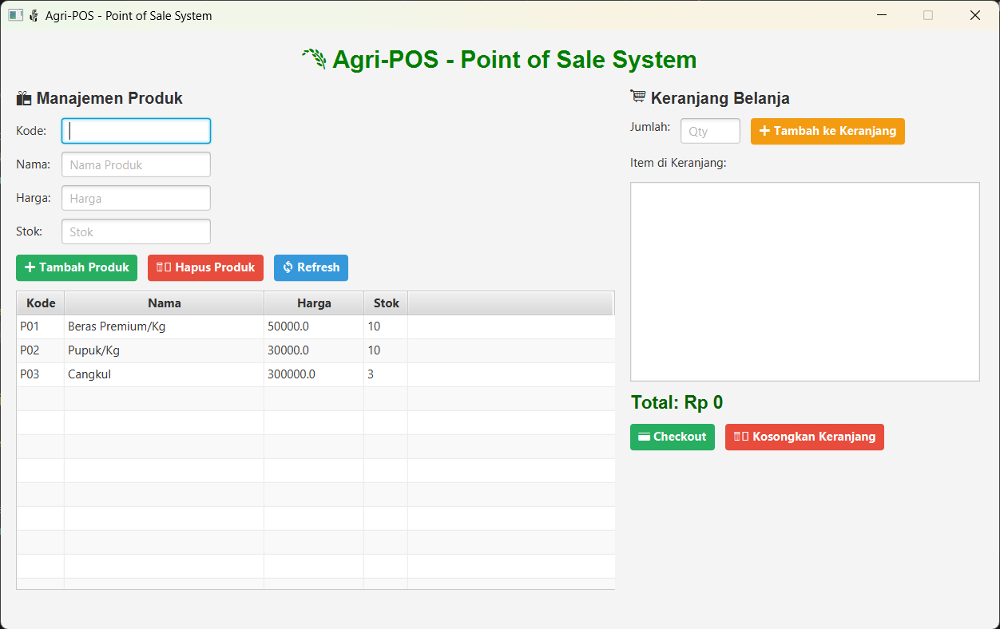
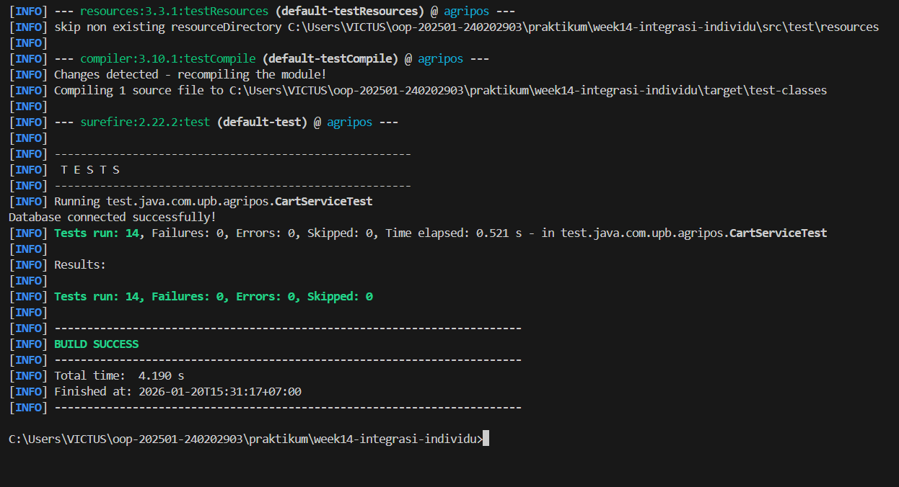
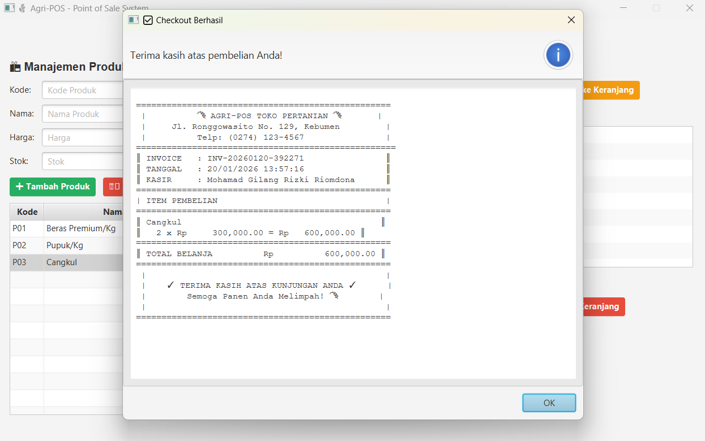
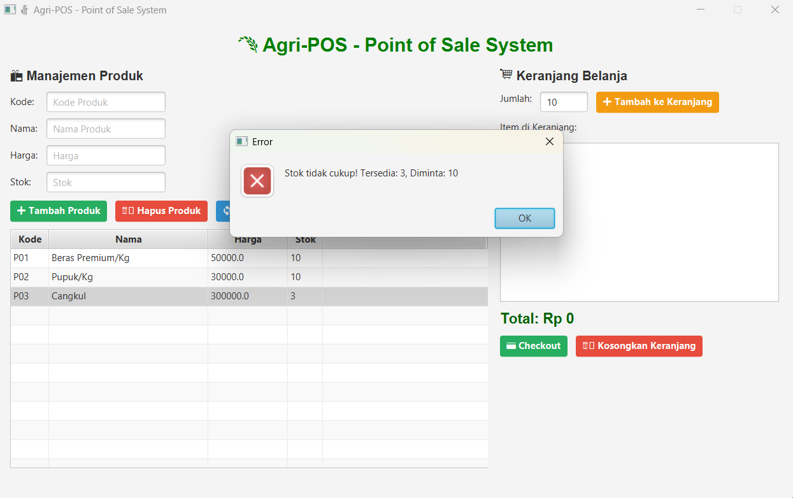
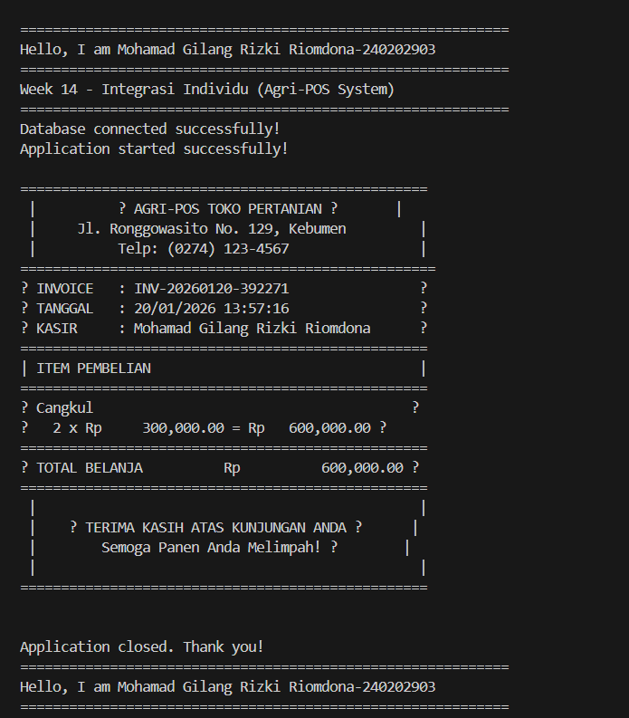

# Laporan Praktikum Minggu 14
Topik: [Integrasi Individu (OOP + Database + GUI)]

## Identitas
- Nama  : [Mohamad Gilang Rizki Riomdona]
- NIM   : [240202903]
- Kelas : [3 IKRB]

---

## Tujuan
(
Setelah mengikuti praktikum ini, mahasiswa mampu:
1. Mengintegrasikan konsep OOP (Bab 1–5) ke dalam satu aplikasi yang utuh.
2. Mengimplementasikan rancangan UML + SOLID (Bab 6) menjadi kode nyata.
3. Mengintegrasikan Collections + Keranjang (Bab 7) ke alur aplikasi.
4. Menerapkan exception handling (Bab 9) untuk validasi dan error flow.
5. Menerapkan pattern + unit testing (Bab 10) pada bagian yang relevan.
6. Menghubungkan aplikasi dengan database via DAO + JDBC (Bab 11).
7. Menyajikan aplikasi berbasis JavaFX (Bab 12–13) yang terhubung ke backend.
)

---

## Dasar Teori
(Tuliskan ringkasan teori singkat (3–5 poin) yang mendasari praktikum.  
Contoh:  
1. Object Oriented Programming (OOP) adalah paradigma pemrograman yang berfokus pada objek yang memiliki atribut dan method.
2. MVC (Model–View–Controller) digunakan untuk memisahkan logika bisnis, tampilan, dan kontrol alur aplikasi.
3. DAO (Data Access Object) berfungsi sebagai perantara antara aplikasi dan database untuk operasi CRUD.
4. Collections Framework digunakan untuk mengelola data dinamis seperti keranjang belanja.
5. Exception Handling digunakan untuk menangani kesalahan input dan kegagalan proses secara terstruktur.)

---

## Langkah Praktikum
(
1. Menyiapkan struktur proyek Java dengan package com.upb.agripos.
2. Membuat model data Product, Cart, dan CartItem.
3. Mengimplementasikan DAO menggunakan JDBC untuk menghubungkan aplikasi dengan database PostgreSQL.
4. Membuat layer Service untuk logika bisnis dan validasi data.
5. Menghubungkan aplikasi JavaFX (View) dengan Controller sesuai prinsip DIP.
6. Menambahkan fitur keranjang belanja menggunakan Collections.
7. Membuat unit test menggunakan JUnit untuk menguji logika keranjang.
8. Menjalankan aplikasi dan memastikan seluruh fitur berjalan dengan baik.
9. Melakukan commit dengan pesan:)

---

## Kode Program
(Tuliskan kode utama yang dibuat, contoh:  

```java (main)
//PosController.java
package com.upb.agripos.controller;

import java.util.List;

import com.upb.agripos.exception.DatabaseException;
import com.upb.agripos.exception.InsufficientStockException;
import com.upb.agripos.exception.ProductNotFoundException;
import com.upb.agripos.exception.ValidationException;
import com.upb.agripos.model.CartItem;
import com.upb.agripos.model.Product;
import com.upb.agripos.model.Transaction;
import com.upb.agripos.service.CartService;
import com.upb.agripos.service.ProductService;

/**
 * PosController - Controller untuk menghubungkan View dan Service
 * Integrasi: Bab 6 (MVC Pattern, SOLID - DIP), Bab 10 (MVC)
 * 
 * Prinsip DIP: Controller tidak langsung akses DAO, hanya lewat Service
 */
public class PosController {
    
    private final ProductService productService;
    private final CartService cartService;

    public PosController() {
        this.productService = new ProductService();
        this.cartService = new CartService();
    }

    public PosController(ProductService productService, CartService cartService) {
        this.productService = productService;
        this.cartService = cartService;
    }

    // ===== PRODUCT OPERATIONS =====
    
    public void addProduct(String code, String name, double price, int stock) 
            throws ValidationException, DatabaseException {
        Product product = new Product(code, name, price, stock);
        productService.addProduct(product);
    }

    public void deleteProduct(String code) 
            throws ValidationException, DatabaseException, ProductNotFoundException {
        productService.deleteProduct(code);
    }

    public List<Product> loadProducts() throws DatabaseException {
        return productService.getAllProducts();
    }

    public Product getProduct(String code) throws DatabaseException, ProductNotFoundException {
        return productService.getProductByCode(code);
    }

    // ===== CART OPERATIONS =====
    
    public void addToCart(Product product, int quantity) 
            throws ValidationException, InsufficientStockException {
        cartService.addToCart(product, quantity);
    }

    public void removeFromCart(String productCode) throws ValidationException {
        cartService.removeFromCart(productCode);
    }

    public List<CartItem> getCartItems() {
        return cartService.getCartItems();
    }

    public double getCartTotal() {
        return cartService.getTotal();
    }

    public void clearCart() {
        cartService.clearCart();
    }

    public boolean isCartEmpty() {
        return cartService.isEmpty();
    }

    public int getCartItemCount() {
        return cartService.getItemCount();
    }

    public Transaction checkout(String cashierName) throws InsufficientStockException, DatabaseException, ValidationException {
        return cartService.checkout(cashierName);
    }
}

//jbdcProduct.java
package com.upb.agripos.dao;

import java.sql.Connection;
import java.sql.PreparedStatement;
import java.sql.ResultSet;
import java.sql.SQLException;
import java.sql.Statement;
import java.util.ArrayList;
import java.util.List;

import com.upb.agripos.exception.DatabaseException;
import com.upb.agripos.model.Product;
import com.upb.agripos.util.DatabaseConnection;

/**
 * JdbcProductDAO - Implementasi ProductDAO menggunakan JDBC
 * Integrasi: Bab 11 (JDBC + DAO Pattern)
 */
public class JdbcProductDAO implements ProductDAO {
    
    private final Connection connection;

    public JdbcProductDAO() {
        this.connection = DatabaseConnection.getInstance().getConnection();
    }

    @Override
    public void insert(Product product) throws DatabaseException {
        String sql = "INSERT INTO products (code, name, price, stock) VALUES (?, ?, ?, ?)";
        
        try (PreparedStatement ps = connection.prepareStatement(sql)) {
            ps.setString(1, product.getCode());
            ps.setString(2, product.getName());
            ps.setDouble(3, product.getPrice());
            ps.setInt(4, product.getStock());
            
            int rows = ps.executeUpdate();
            if (rows == 0) {
                throw new DatabaseException("Failed to insert product");
            }
        } catch (SQLException e) {
            throw new DatabaseException("Database error during insert: " + e.getMessage(), e);
        }
    }

    @Override
    public void update(Product product) throws DatabaseException {
        String sql = "UPDATE products SET name = ?, price = ?, stock = ? WHERE code = ?";
        
        try (PreparedStatement ps = connection.prepareStatement(sql)) {
            ps.setString(1, product.getName());
            ps.setDouble(2, product.getPrice());
            ps.setInt(3, product.getStock());
            ps.setString(4, product.getCode());
            
            ps.executeUpdate();
        } catch (SQLException e) {
            throw new DatabaseException("Database error during update: " + e.getMessage(), e);
        }
    }

    @Override
    public void delete(String code) throws DatabaseException {
        String sql = "DELETE FROM products WHERE code = ?";
        
        try (PreparedStatement ps = connection.prepareStatement(sql)) {
            ps.setString(1, code);
            ps.executeUpdate();
        } catch (SQLException e) {
            throw new DatabaseException("Database error during delete: " + e.getMessage(), e);
        }
    }

    @Override
    public Product findByCode(String code) throws DatabaseException {
        String sql = "SELECT * FROM products WHERE code = ?";
        
        try (PreparedStatement ps = connection.prepareStatement(sql)) {
            ps.setString(1, code);
            
            try (ResultSet rs = ps.executeQuery()) {
                if (rs.next()) {
                    return mapResultSetToProduct(rs);
                }
            }
        } catch (SQLException e) {
            throw new DatabaseException("Database error during findByCode: " + e.getMessage(), e);
        }
        
        return null;
    }

    @Override
    public List<Product> findAll() throws DatabaseException {
        List<Product> products = new ArrayList<>();
        String sql = "SELECT * FROM products ORDER BY code";
        
        try (Statement stmt = connection.createStatement();
             ResultSet rs = stmt.executeQuery(sql)) {
            
            while (rs.next()) {
                products.add(mapResultSetToProduct(rs));
            }
        } catch (SQLException e) {
            throw new DatabaseException("Database error during findAll: " + e.getMessage(), e);
        }
        
        return products;
    }

    private Product mapResultSetToProduct(ResultSet rs) throws SQLException {
        return new Product(
            rs.getString("code"),
            rs.getString("name"),
            rs.getDouble("price"),
            rs.getInt("stock")
        );
    }
}

//ProductDAO.java
package com.upb.agripos.dao;

import java.util.List;

import com.upb.agripos.exception.DatabaseException;
import com.upb.agripos.model.Product;

/**
 * ProductDAO - Interface untuk Data Access Object
 * Integrasi: Bab 6 (SOLID - DIP), Bab 11 (DAO Pattern)
 */
public interface ProductDAO {
    void insert(Product product) throws DatabaseException;
    void update(Product product) throws DatabaseException;
    void delete(String code) throws DatabaseException;
    Product findByCode(String code) throws DatabaseException;
    List<Product> findAll() throws DatabaseException;
}


//DatabaseException.java
package com.upb.agripos.exception;

/**
 * DatabaseException - Exception untuk error database
 * Integrasi: Bab 9 (Exception Handling)
 */
public class DatabaseException extends Exception {
    public DatabaseException(String message) {
        super(message);
    }

    public DatabaseException(String message, Throwable cause) {
        super(message, cause);
    }
}

//insufficientStockException.java
package com.upb.agripos.exception;

/**
 * InsufficientStockException - Exception ketika stok tidak cukup
 * Integrasi: Bab 9 (Exception Handling)
 */
public class InsufficientStockException extends Exception {
    public InsufficientStockException(String message) {
        super(message);
    }
}

//ProductNotFoundException.java
package com.upb.agripos.exception;

/**
 * ProductNotFoundException - Exception ketika produk tidak ditemukan
 * Integrasi: Bab 9 (Exception Handling)
 */
public class ProductNotFoundException extends Exception {
    public ProductNotFoundException(String message) {
        super(message);
    }
}

//ValidationException.java
package com.upb.agripos.exception;

/**
 * ValidationException - Exception untuk validasi input
 * Integrasi: Bab 9 (Exception Handling)
 */
public class ValidationException extends Exception {
    public ValidationException(String message) {
        super(message);
    }
}

//Cart.java
package com.upb.agripos.model;

import java.util.ArrayList;
import java.util.HashMap;
import java.util.List;
import java.util.Map;

/**
 * Cart - Keranjang Belanja
 * Integrasi: Bab 7 (Collections - List & Map)
 */
public class Cart {
    private final Map<String, CartItem> items = new HashMap<>();

    public void addItem(Product product, int quantity) {
        String code = product.getCode();
        
        if (items.containsKey(code)) {
            CartItem existing = items.get(code);
            existing.setQuantity(existing.getQuantity() + quantity);
        } else {
            items.put(code, new CartItem(product, quantity));
        }
    }

    public void removeItem(String productCode) {
        items.remove(productCode);
    }

    public void updateQuantity(String productCode, int newQuantity) {
        if (items.containsKey(productCode)) {
            items.get(productCode).setQuantity(newQuantity);
        }
    }

    public List<CartItem> getItems() {
        return new ArrayList<>(items.values());
    }

    public double getTotal() {
        return items.values().stream()
            .mapToDouble(CartItem::getSubtotal)
            .sum();
    }

    public void clear() {
        items.clear();
    }

    public boolean isEmpty() {
        return items.isEmpty();
    }

    public int getItemCount() {
        return items.size();
    }
}

//CartItem.java
package com.upb.agripos.model;

/**
 * CartItem - Item dalam keranjang
 * Integrasi: Bab 7 (Collections)
 */
public class CartItem {
    private Product product;
    private int quantity;

    public CartItem(Product product, int quantity) {
        this.product = product;
        this.quantity = quantity;
    }

    public Product getProduct() { return product; }
    public int getQuantity() { return quantity; }
    public void setQuantity(int quantity) { this.quantity = quantity; }

    public double getSubtotal() {
        return product.getPrice() * quantity;
    }

    @Override
    public String toString() {
        return String.format("%s x%d = Rp%.2f", 
            product.getName(), quantity, getSubtotal());
    }
}


//Product.java
package com.upb.agripos.model;

import javafx.beans.property.DoubleProperty;
import javafx.beans.property.IntegerProperty;
import javafx.beans.property.SimpleDoubleProperty;
import javafx.beans.property.SimpleIntegerProperty;
import javafx.beans.property.SimpleStringProperty;
import javafx.beans.property.StringProperty;

/**
 * Model Product dengan JavaFX Property untuk binding ke TableView
 * Integrasi: Bab 2 (Encapsulation), Bab 13 (JavaFX Properties)
 */
public class Product {
    private final StringProperty code = new SimpleStringProperty();
    private final StringProperty name = new SimpleStringProperty();
    private final DoubleProperty price = new SimpleDoubleProperty();
    private final IntegerProperty stock = new SimpleIntegerProperty();

    public Product(String code, String name, double price, int stock) {
        this.code.set(code);
        this.name.set(name);
        this.price.set(price);
        this.stock.set(stock);
    }

    // ===== STANDARD GETTER (untuk DAO & Service) =====
    public String getCode() { return code.get(); }
    public String getName() { return name.get(); }
    public double getPrice() { return price.get(); }
    public int getStock() { return stock.get(); }

    // ===== STANDARD SETTER =====
    public void setCode(String code) { this.code.set(code); }
    public void setName(String name) { this.name.set(name); }
    public void setPrice(double price) { this.price.set(price); }
    public void setStock(int stock) { this.stock.set(stock); }

    // ===== PROPERTY GETTER (untuk TableView binding) =====
    public StringProperty codeProperty() { return code; }
    public StringProperty nameProperty() { return name; }
    public DoubleProperty priceProperty() { return price; }
    public IntegerProperty stockProperty() { return stock; }

    public void reduceStock(int qty) {
        this.stock.set(this.stock.get() - qty);
    }

    public void addStock(int qty) {
        this.stock.set(this.stock.get() + qty);
    }
}

//Receiptable.java
package com.upb.agripos.model;

/**
 * Receiptable - Interface untuk objek yang bisa mencetak struk
 * Integrasi: Bab 5 (Abstraction - Interface)
 */
public interface Receiptable {
    String generateReceipt();
}

//Transaction.java
package com.upb.agripos.model;

import java.time.LocalDateTime;
import java.time.format.DateTimeFormatter;
import java.util.List;

/**
 * Transaction - Model untuk transaksi checkout
 * Integrasi: Bab 5 (Abstraction), Bab 7 (Collections)
 */
public class Transaction implements Receiptable {
    
    private String invoiceNo;
    private LocalDateTime timestamp;
    private List<CartItem> items;
    private double total;
    private String cashierName;

    public Transaction(String invoiceNo, List<CartItem> items, double total, String cashierName) {
        this.invoiceNo = invoiceNo;
        this.timestamp = LocalDateTime.now();
        this.items = items;
        this.total = total;
        this.cashierName = cashierName;
    }

    public String getInvoiceNo() { return invoiceNo; }
    public LocalDateTime getTimestamp() { return timestamp; }
    public List<CartItem> getItems() { return items; }
    public double getTotal() { return total; }
    public String getCashierName() { return cashierName; }

    @Override
    public String generateReceipt() {
        StringBuilder receipt = new StringBuilder();
        DateTimeFormatter formatter = DateTimeFormatter.ofPattern("dd/MM/yyyy HH:mm:ss");
        
        receipt.append("\n");
        receipt.append("==================================================\n");
        receipt.append(" |          🌾 AGRI-POS TOKO PERTANIAN 🌾       |\n");
        receipt.append(" |     Jl. Ronggowasito No. 129, Kebumen         |\n");
        receipt.append(" |          Telp: (0274) 123-4567                |\n");
        receipt.append("===================================================\n");
        receipt.append(String.format("║ INVOICE   : %-35s║\n", invoiceNo));
        receipt.append(String.format("║ TANGGAL   : %-35s║\n", timestamp.format(formatter)));
        receipt.append(String.format("║ KASIR     : %-35s║\n", cashierName));
        receipt.append("==================================================\n");
        receipt.append("| ITEM PEMBELIAN                                 |\n");
        receipt.append("==================================================\n");
        
        // Detail items
        for (CartItem item : items) {
            String itemName = item.getProduct().getName();
            int qty = item.getQuantity();
            double price = item.getProduct().getPrice();
            double subtotal = item.getSubtotal();
            
            // Truncate nama jika terlalu panjang
            if (itemName.length() > 25) {
                itemName = itemName.substring(0, 22) + "...";
            }
            
            receipt.append(String.format("║ %-25s                     ║\n", itemName));
            receipt.append(String.format("║   %d x Rp%,15.2f = Rp%,13.2f ║\n", 
                qty, price, subtotal));
        }
        
        receipt.append("==================================================\n");
        receipt.append(String.format("║ TOTAL BELANJA          Rp%,20.2f ║\n", total));
        receipt.append("==================================================\n");
        receipt.append(" |                                               |\n");
        receipt.append(" |    ✓ TERIMA KASIH ATAS KUNJUNGAN ANDA ✓      |\n");
        receipt.append(" |        Semoga Panen Anda Melimpah! 🌾        |\n");
        receipt.append(" |                                               |\n");
        receipt.append("==================================================\n");
        
        return receipt.toString();
    }

    /**
     * Generate nomor invoice otomatis
     * Format: INV-YYYYMMDD-XXXXXX
     */
    public static String generateInvoiceNo() {
        LocalDateTime now = LocalDateTime.now();
        String datePart = now.format(DateTimeFormatter.ofPattern("yyyyMMdd"));
        int randomPart = (int) (Math.random() * 999999);
        return String.format("INV-%s-%06d", datePart, randomPart);
    }
}

//CartService.java
package com.upb.agripos.service;

import java.util.ArrayList;
import java.util.List;

import com.upb.agripos.exception.DatabaseException;
import com.upb.agripos.exception.InsufficientStockException;
import com.upb.agripos.exception.ValidationException;
import com.upb.agripos.model.Cart;
import com.upb.agripos.model.CartItem;
import com.upb.agripos.model.Product;
import com.upb.agripos.model.Transaction;

/**
 * CartService - Business Logic untuk Keranjang Belanja
 * Integrasi: Bab 7 (Collections), Bab 9 (Exception)
 */
public class CartService {
    
    private final Cart cart;
    private final ProductService productService;

    public CartService() {
        this.cart = new Cart();
        this.productService = new ProductService();
    }

    public CartService(ProductService productService) {
        this.cart = new Cart();
        this.productService = productService;
    }

    public void addToCart(Product product, int quantity) throws ValidationException, InsufficientStockException {
        if (product == null) {
            throw new ValidationException("Produk tidak boleh null!");
        }
        
        if (quantity <= 0) {
            throw new ValidationException("Quantity harus lebih dari 0!");
        }
        
        if (product.getStock() < quantity) {
            throw new InsufficientStockException(
                "Stok tidak cukup! Tersedia: " + product.getStock() + ", Diminta: " + quantity
            );
        }
        
        cart.addItem(product, quantity);
    }

    public void removeFromCart(String productCode) throws ValidationException {
        if (productCode == null || productCode.trim().isEmpty()) {
            throw new ValidationException("Kode produk tidak boleh kosong!");
        }
        
        cart.removeItem(productCode);
    }

    public void updateQuantity(String productCode, int newQuantity) throws ValidationException {
        if (newQuantity <= 0) {
            throw new ValidationException("Quantity harus lebih dari 0!");
        }
        
        cart.updateQuantity(productCode, newQuantity);
    }

    public List<CartItem> getCartItems() {
        return cart.getItems();
    }

    public double getTotal() {
        return cart.getTotal();
    }

    public void clearCart() {
        cart.clear();
    }

    public boolean isEmpty() {
        return cart.isEmpty();
    }

    public int getItemCount() {
        return cart.getItemCount();
    }

    public Transaction checkout(String cashierName) throws InsufficientStockException, DatabaseException, ValidationException {
        if (cart.isEmpty()) {
            throw new IllegalStateException("Keranjang kosong!");
        }
        
        // Validasi stok untuk semua item
        for (CartItem item : cart.getItems()) {
            if (item.getProduct().getStock() < item.getQuantity()) {
                throw new InsufficientStockException(
                    "Stok tidak cukup untuk " + item.getProduct().getName()
                );
            }
        }
        
        // Buat transaksi
        String invoiceNo = Transaction.generateInvoiceNo();
        List<CartItem> soldItems = new ArrayList<>(cart.getItems());
        double total = cart.getTotal();
        
        Transaction transaction = new Transaction(invoiceNo, soldItems, total, cashierName);
        
        // Kurangi stok di memory DAN database
        for (CartItem item : cart.getItems()) {
            Product product = item.getProduct();
            product.reduceStock(item.getQuantity());
            
            // 🔥 UPDATE KE DATABASE - INI YANG KURANG!
            try {
                productService.updateStock(product);
            } catch (Exception e) {
                // Rollback jika gagal
                product.addStock(item.getQuantity());
                throw new DatabaseException("Gagal update stok ke database: " + e.getMessage());
            }
        }
        
        cart.clear();
        
        return transaction;
    }
}

//ProductService.java
package com.upb.agripos.service;

import java.util.List;

import com.upb.agripos.dao.JdbcProductDAO;
import com.upb.agripos.dao.ProductDAO;
import com.upb.agripos.exception.DatabaseException;
import com.upb.agripos.exception.ProductNotFoundException;
import com.upb.agripos.exception.ValidationException;
import com.upb.agripos.model.Product;

/**
 * ProductService - Business Logic Layer
 * Integrasi: Bab 6 (SOLID - SRP, DIP), Bab 9 (Exception), Bab 11 (DAO)
 */
public class ProductService {
    
    private final ProductDAO productDAO;

    public ProductService() {
        this.productDAO = new JdbcProductDAO();
    }

    public ProductService(ProductDAO productDAO) {
        this.productDAO = productDAO;
    }

    /**
     * Update stok produk ke database
     * Digunakan setelah checkout untuk sync database
     */
    public void updateStock(Product product) throws DatabaseException, ValidationException {
        if (product == null) {
            throw new ValidationException("Produk tidak boleh null!");
        }
        
        if (product.getStock() < 0) {
            throw new ValidationException("Stok tidak boleh negatif!");
        }
        
        productDAO.update(product);
    }

    public void addProduct(Product product) throws ValidationException, DatabaseException {
        // Validasi
        validateProduct(product);
        
        // Cek duplikasi
        Product existing = productDAO.findByCode(product.getCode());
        if (existing != null) {
            throw new ValidationException("Produk dengan kode " + product.getCode() + " sudah ada!");
        }
        
        productDAO.insert(product);
    }

    public void updateProduct(Product product) throws ValidationException, DatabaseException, ProductNotFoundException {
        validateProduct(product);
        
        Product existing = productDAO.findByCode(product.getCode());
        if (existing == null) {
            throw new ProductNotFoundException("Produk dengan kode " + product.getCode() + " tidak ditemukan!");
        }
        
        productDAO.update(product);
    }

    public void deleteProduct(String code) throws ValidationException, DatabaseException, ProductNotFoundException {
        if (code == null || code.trim().isEmpty()) {
            throw new ValidationException("Kode produk tidak boleh kosong!");
        }
        
        Product existing = productDAO.findByCode(code);
        if (existing == null) {
            throw new ProductNotFoundException("Produk dengan kode " + code + " tidak ditemukan!");
        }
        
        productDAO.delete(code);
    }

    public Product getProductByCode(String code) throws DatabaseException, ProductNotFoundException {
        Product product = productDAO.findByCode(code);
        if (product == null) {
            throw new ProductNotFoundException("Produk dengan kode " + code + " tidak ditemukan!");
        }
        return product;
    }

    public List<Product> getAllProducts() throws DatabaseException {
        return productDAO.findAll();
    }

    private void validateProduct(Product product) throws ValidationException {
        if (product == null) {
            throw new ValidationException("Produk tidak boleh null!");
        }
        
        if (product.getCode() == null || product.getCode().trim().isEmpty()) {
            throw new ValidationException("Kode produk tidak boleh kosong!");
        }
        
        if (product.getName() == null || product.getName().trim().isEmpty()) {
            throw new ValidationException("Nama produk tidak boleh kosong!");
        }
        
        if (product.getPrice() <= 0) {
            throw new ValidationException("Harga harus lebih dari 0!");
        }
        
        if (product.getStock() < 0) {
            throw new ValidationException("Stok tidak boleh negatif!");
        }
    }
}

//DatabaseConnection.java
package com.upb.agripos.util;

import java.sql.Connection;
import java.sql.DriverManager;
import java.sql.SQLException;

/**
 * DatabaseConnection - Singleton Pattern untuk koneksi database
 * Integrasi: Bab 10 (Design Pattern - Singleton), Bab 11 (JDBC)
 */
public class DatabaseConnection {
    private static DatabaseConnection instance;
    private Connection connection;

    private static final String URL = "jdbc:postgresql://localhost:5432/agripos";
    private static final String USER = "postgres";
    private static final String PASSWORD = "071005";

    // Private constructor (Singleton)
    private DatabaseConnection() {
        try {
            connection = DriverManager.getConnection(URL, USER, PASSWORD);
            System.out.println("Database connected successfully!");
        } catch (SQLException e) {
            throw new RuntimeException("Failed to connect to database", e);
        }
    }

    // Singleton accessor
    public static DatabaseConnection getInstance() {
        if (instance == null) {
            synchronized (DatabaseConnection.class) {
                if (instance == null) {
                    instance = new DatabaseConnection();
                }
            }
        }
        return instance;
    }

    public Connection getConnection() {
        return connection;
    }

    public void closeConnection() {
        try {
            if (connection != null && !connection.isClosed()) {
                connection.close();
                System.out.println("Database connection closed.");
            }
        } catch (SQLException e) {
            e.printStackTrace();
        }
    }
}

//PosView.java
package com.upb.agripos.view;

import com.upb.agripos.controller.PosController;
import com.upb.agripos.model.CartItem;
import com.upb.agripos.model.Product;
import com.upb.agripos.model.Transaction;

import javafx.collections.FXCollections;
import javafx.collections.ObservableList;
import javafx.geometry.Insets;
import javafx.geometry.Pos;
import javafx.scene.control.Alert;
import javafx.scene.control.Button;
import javafx.scene.control.ButtonType;
import javafx.scene.control.Label;
import javafx.scene.control.ListView;
import javafx.scene.control.TableColumn;
import javafx.scene.control.TableView;
import javafx.scene.control.TextArea;
import javafx.scene.control.TextField;
import javafx.scene.control.cell.PropertyValueFactory;
import javafx.scene.layout.BorderPane;
import javafx.scene.layout.GridPane;
import javafx.scene.layout.HBox;
import javafx.scene.layout.VBox;
import javafx.scene.paint.Color;
import javafx.scene.text.Font;
import javafx.scene.text.FontWeight;

/**
 * PosView - Main GUI View menggunakan JavaFX
 * Integrasi: Bab 12 & 13 (JavaFX), Bab 6 (MVC - View)
 */
public class PosView extends BorderPane {

    private final PosController controller;
    
    // Product Table
    private final TableView<Product> productTable = new TableView<>();
    private final ObservableList<Product> productData = FXCollections.observableArrayList();
    
    // Cart Area
    private final ListView<String> cartListView = new ListView<>();
    private final Label totalLabel = new Label("Total: Rp 0");
    
    // Form Fields
    private final TextField txtCode = new TextField();
    private final TextField txtName = new TextField();
    private final TextField txtPrice = new TextField();
    private final TextField txtStock = new TextField();
    private final TextField txtQuantity = new TextField();

    public PosView() {
        this.controller = new PosController();
        initializeUI();
        loadProducts();
    }

    private void initializeUI() {
        setPadding(new Insets(15));
        
        // Header
        Label header = new Label("🌾 Agri-POS - Point of Sale System");
        header.setFont(Font.font("Arial", FontWeight.BOLD, 24));
        header.setTextFill(Color.GREEN);
        setTop(header);
        BorderPane.setAlignment(header, Pos.CENTER);
        BorderPane.setMargin(header, new Insets(0, 0, 15, 0));
        
        // Left: Product Management
        VBox leftPanel = createProductPanel();
        
        // Right: Shopping Cart
        VBox rightPanel = createCartPanel();
        
        // Main Layout
        HBox mainContent = new HBox(15, leftPanel, rightPanel);
        setCenter(mainContent);
    }

    private VBox createProductPanel() {
        VBox panel = new VBox(10);
        panel.setPrefWidth(600);
        
        // Title
        Label title = new Label("📦 Manajemen Produk");
        title.setFont(Font.font("Arial", FontWeight.BOLD, 16));
        
        // Form
        GridPane form = new GridPane();
        form.setHgap(10);
        form.setVgap(8);
        
        txtCode.setPromptText("Kode Produk");
        txtName.setPromptText("Nama Produk");
        txtPrice.setPromptText("Harga");
        txtStock.setPromptText("Stok");
        
        form.add(new Label("Kode:"), 0, 0);
        form.add(txtCode, 1, 0);
        form.add(new Label("Nama:"), 0, 1);
        form.add(txtName, 1, 1);
        form.add(new Label("Harga:"), 0, 2);
        form.add(txtPrice, 1, 2);
        form.add(new Label("Stok:"), 0, 3);
        form.add(txtStock, 1, 3);
        
        // Buttons
        Button btnAdd = new Button("➕ Tambah Produk");
        Button btnDelete = new Button("🗑️ Hapus Produk");
        Button btnRefresh = new Button("🔄 Refresh");
        
        btnAdd.setStyle("-fx-background-color: #27ae60; -fx-text-fill: white; -fx-font-weight: bold;");
        btnDelete.setStyle("-fx-background-color: #e74c3c; -fx-text-fill: white; -fx-font-weight: bold;");
        btnRefresh.setStyle("-fx-background-color: #3498db; -fx-text-fill: white; -fx-font-weight: bold;");
        
        btnAdd.setOnAction(e -> handleAddProduct());
        btnDelete.setOnAction(e -> handleDeleteProduct());
        btnRefresh.setOnAction(e -> loadProducts());
        
        HBox buttonBox = new HBox(10, btnAdd, btnDelete, btnRefresh);
        
        // Table
        setupProductTable();
        
        panel.getChildren().addAll(title, form, buttonBox, productTable);
        return panel;
    }

    private void setupProductTable() {
        TableColumn<Product, String> colCode = new TableColumn<>("Kode");
        colCode.setCellValueFactory(new PropertyValueFactory<>("code"));
        colCode.setPrefWidth(80);
        
        TableColumn<Product, String> colName = new TableColumn<>("Nama");
        colName.setCellValueFactory(new PropertyValueFactory<>("name"));
        colName.setPrefWidth(200);
        
        TableColumn<Product, Double> colPrice = new TableColumn<>("Harga");
        colPrice.setCellValueFactory(new PropertyValueFactory<>("price"));
        colPrice.setPrefWidth(100);
        
        TableColumn<Product, Integer> colStock = new TableColumn<>("Stok");
        colStock.setCellValueFactory(new PropertyValueFactory<>("stock"));
        colStock.setPrefWidth(80);
        
        productTable.getColumns().addAll(colCode, colName, colPrice, colStock);
        productTable.setItems(productData);
        productTable.setPrefHeight(300);
    }

    private VBox createCartPanel() {
        VBox panel = new VBox(10);
        panel.setPrefWidth(350);
        
        // Title
        Label title = new Label("🛒 Keranjang Belanja");
        title.setFont(Font.font("Arial", FontWeight.BOLD, 16));
        
        // Quantity Input
        HBox qtyBox = new HBox(10);
        txtQuantity.setPromptText("Qty");
        txtQuantity.setPrefWidth(60);
        Button btnAddToCart = new Button("➕ Tambah ke Keranjang");
        btnAddToCart.setStyle("-fx-background-color: #f39c12; -fx-text-fill: white; -fx-font-weight: bold;");
        btnAddToCart.setOnAction(e -> handleAddToCart());
        qtyBox.getChildren().addAll(new Label("Jumlah:"), txtQuantity, btnAddToCart);
        
        // Cart List
        cartListView.setPrefHeight(200);
        
        // Total
        totalLabel.setFont(Font.font("Arial", FontWeight.BOLD, 18));
        totalLabel.setTextFill(Color.DARKGREEN);
        
        // Buttons
        Button btnCheckout = new Button("💳 Checkout");
        Button btnClearCart = new Button("🗑️ Kosongkan Keranjang");
        
        btnCheckout.setStyle("-fx-background-color: #27ae60; -fx-text-fill: white; -fx-font-weight: bold;");
        btnClearCart.setStyle("-fx-background-color: #e74c3c; -fx-text-fill: white; -fx-font-weight: bold;");
        
        btnCheckout.setOnAction(e -> handleCheckout());
        btnClearCart.setOnAction(e -> handleClearCart());
        
        HBox cartButtons = new HBox(10, btnCheckout, btnClearCart);
        
        panel.getChildren().addAll(title, qtyBox, new Label("Item di Keranjang:"), 
                                    cartListView, totalLabel, cartButtons);
        return panel;
    }

    // ===== EVENT HANDLERS =====
    
    private void handleAddProduct() {
        try {
            String code = txtCode.getText();
            String name = txtName.getText();
            double price = Double.parseDouble(txtPrice.getText());
            int stock = Integer.parseInt(txtStock.getText());
            
            controller.addProduct(code, name, price, stock);
            
            showAlert(Alert.AlertType.INFORMATION, "Sukses", "Produk berhasil ditambahkan!");
            clearProductForm();
            loadProducts();
            
        } catch (NumberFormatException e) {
            showAlert(Alert.AlertType.ERROR, "Error", "Harga dan stok harus berupa angka!");
        } catch (Exception e) {
            showAlert(Alert.AlertType.ERROR, "Error", e.getMessage());
        }
    }

    private void handleDeleteProduct() {
        Product selected = productTable.getSelectionModel().getSelectedItem();
        if (selected == null) {
            showAlert(Alert.AlertType.WARNING, "Peringatan", "Pilih produk yang akan dihapus!");
            return;
        }
        
        Alert confirm = new Alert(Alert.AlertType.CONFIRMATION);
        confirm.setTitle("Konfirmasi Hapus");
        confirm.setHeaderText("Yakin ingin menghapus produk?");
        confirm.setContentText(selected.getName());
        
        confirm.showAndWait().ifPresent(response -> {
            if (response == ButtonType.OK) {
                try {
                    controller.deleteProduct(selected.getCode());
                    showAlert(Alert.AlertType.INFORMATION, "Sukses", "Produk berhasil dihapus!");
                    loadProducts();
                } catch (Exception e) {
                    showAlert(Alert.AlertType.ERROR, "Error", e.getMessage());
                }
            }
        });
    }

    private void handleAddToCart() {
        Product selected = productTable.getSelectionModel().getSelectedItem();
        if (selected == null) {
            showAlert(Alert.AlertType.WARNING, "Peringatan", "Pilih produk terlebih dahulu!");
            return;
        }
        
        try {
            int quantity = Integer.parseInt(txtQuantity.getText());
            controller.addToCart(selected, quantity);
            
            updateCartView();
            txtQuantity.clear();
            
        } catch (NumberFormatException e) {
            showAlert(Alert.AlertType.ERROR, "Error", "Jumlah harus berupa angka!");
        } catch (Exception e) {
            showAlert(Alert.AlertType.ERROR, "Error", e.getMessage());
        }
    }

    private void handleCheckout() {
        if (controller.isCartEmpty()) {
            showAlert(Alert.AlertType.WARNING, "Peringatan", "Keranjang masih kosong!");
            return;
        }
        
        Alert confirm = new Alert(Alert.AlertType.CONFIRMATION);
        confirm.setTitle("Konfirmasi Checkout");
        confirm.setHeaderText("Lanjutkan pembayaran?");
        confirm.setContentText("Total: Rp " + String.format("%,.2f", controller.getCartTotal()));
        
        confirm.showAndWait().ifPresent(response -> {
            if (response == ButtonType.OK) {
                try {
                    // Checkout dan dapatkan transaction
                    String cashierName = "Mohamad Gilang Rizki Riomdona";
                    Transaction transaction = controller.checkout(cashierName);
                    
                    // Tampilkan struk di console
                    String receipt = transaction.generateReceipt();
                    System.out.println(receipt);
                    
                    // Tampilkan struk di dialog
                    showReceiptDialog(receipt);
                    
                    // Update UI
                    updateCartView();
                    loadProducts(); // Refresh stok
                    
                } catch (Exception e) {
                    showAlert(Alert.AlertType.ERROR, "Error", e.getMessage());
                }
            }
        });
    }

    private void showReceiptDialog(String receipt) {
        Alert receiptAlert = new Alert(Alert.AlertType.INFORMATION);
        receiptAlert.setTitle("✅ Checkout Berhasil");
        receiptAlert.setHeaderText("Terima kasih atas pembelian Anda!");
        
        // Gunakan TextArea untuk struk dengan font monospace
        TextArea receiptArea = new TextArea(receipt);
        receiptArea.setEditable(false);
        receiptArea.setWrapText(false);
        receiptArea.setFont(Font.font("Courier New", 12));
        receiptArea.setPrefSize(600, 500);
        
        receiptAlert.getDialogPane().setContent(receiptArea);
        receiptAlert.getDialogPane().setPrefSize(650, 550);
        
        receiptAlert.showAndWait();
    }

    private void handleClearCart() {
        controller.clearCart();
        updateCartView();
    }

    private void updateCartView() {
        cartListView.getItems().clear();
        
        for (CartItem item : controller.getCartItems()) {
            cartListView.getItems().add(item.toString());
        }
        
        totalLabel.setText(String.format("Total: Rp %.2f", controller.getCartTotal()));
    }

    private void loadProducts() {
        try {
            productData.clear();
            productData.addAll(controller.loadProducts());
        } catch (Exception e) {
            showAlert(Alert.AlertType.ERROR, "Error", "Gagal memuat data: " + e.getMessage());
        }
    }

    private void clearProductForm() {
        txtCode.clear();
        txtName.clear();
        txtPrice.clear();
        txtStock.clear();
    }

    private void showAlert(Alert.AlertType type, String title, String message) {
        Alert alert = new Alert(type);
        alert.setTitle(title);
        alert.setHeaderText(null);
        alert.setContentText(message);
        alert.showAndWait();
    }
}


```
```java (test)
//CartService.java
package test.java.com.upb.agripos;

import static org.junit.jupiter.api.Assertions.assertEquals;
import static org.junit.jupiter.api.Assertions.assertFalse;
import static org.junit.jupiter.api.Assertions.assertNotEquals;
import static org.junit.jupiter.api.Assertions.assertNotNull;
import static org.junit.jupiter.api.Assertions.assertThrows;
import static org.junit.jupiter.api.Assertions.assertTrue;
import org.junit.jupiter.api.BeforeEach;
import org.junit.jupiter.api.Test;

import com.upb.agripos.exception.DatabaseException;
import com.upb.agripos.exception.InsufficientStockException;
import com.upb.agripos.exception.ValidationException;
import com.upb.agripos.model.Product;
import com.upb.agripos.model.Transaction;
import com.upb.agripos.service.CartService;
import com.upb.agripos.service.ProductService;

/**
 * CartServiceTest - Unit Testing untuk CartService
 * Integrasi: Bab 10 (Unit Testing dengan JUnit)
 * 
 * NOTE: Test ini menggunakan in-memory objects tanpa database
 * Untuk test dengan database, gunakan integration test terpisah
 */
class CartServiceTest {

    private CartService cartService;
    private Product product1;
    private Product product2;

    @BeforeEach
    void setUp() {
        // Gunakan constructor tanpa ProductService untuk unit test
        // (tidak perlu database connection di unit test)
        cartService = new CartService(new MockProductService());
        product1 = new Product("P01", "Pupuk Organik", 25000, 10);
        product2 = new Product("P02", "Benih Padi", 15000, 20);
    }

    /**
     * Mock ProductService untuk unit testing tanpa database
     */
    private static class MockProductService extends ProductService {
        @Override
        public void updateStock(Product product) throws DatabaseException, ValidationException {
            // Mock: tidak melakukan apa-apa, hanya validasi
            if (product == null) {
                throw new ValidationException("Produk tidak boleh null!");
            }
            if (product.getStock() < 0) {
                throw new ValidationException("Stok tidak boleh negatif!");
            }
            // Success - do nothing (mock)
        }
    }

    @Test
    void testAddToCart_Success() throws ValidationException, InsufficientStockException {
        cartService.addToCart(product1, 2);
        
        assertEquals(1, cartService.getItemCount());
        assertEquals(50000, cartService.getTotal());
    }

    @Test
    void testAddToCart_MultipleProducts() throws ValidationException, InsufficientStockException {
        cartService.addToCart(product1, 2);
        cartService.addToCart(product2, 3);
        
        assertEquals(2, cartService.getItemCount());
        assertEquals(95000, cartService.getTotal()); // (2*25000) + (3*15000)
    }

    @Test
    void testAddToCart_InvalidQuantity() {
        assertThrows(ValidationException.class, () -> {
            cartService.addToCart(product1, 0);
        });
        
        assertThrows(ValidationException.class, () -> {
            cartService.addToCart(product1, -5);
        });
    }

    @Test
    void testAddToCart_InsufficientStock() {
        assertThrows(InsufficientStockException.class, () -> {
            cartService.addToCart(product1, 15); // Stok hanya 10
        });
    }

    @Test
    void testAddToCart_NullProduct() {
        assertThrows(ValidationException.class, () -> {
            cartService.addToCart(null, 2);
        });
    }

    @Test
    void testRemoveFromCart() throws ValidationException, InsufficientStockException {
        cartService.addToCart(product1, 2);
        cartService.addToCart(product2, 3);
        
        assertEquals(2, cartService.getItemCount());
        
        cartService.removeFromCart("P01");
        
        assertEquals(1, cartService.getItemCount());
        assertEquals(45000, cartService.getTotal());
    }

    @Test
    void testClearCart() throws ValidationException, InsufficientStockException {
        cartService.addToCart(product1, 2);
        cartService.addToCart(product2, 3);
        
        assertFalse(cartService.isEmpty());
        
        cartService.clearCart();
        
        assertTrue(cartService.isEmpty());
        assertEquals(0, cartService.getTotal());
    }

    @Test
    void testCheckout_Success() throws ValidationException, InsufficientStockException, DatabaseException {
        cartService.addToCart(product1, 2);
        
        int originalStock = product1.getStock();
        
        Transaction transaction = cartService.checkout("Test Kasir");
        
        assertNotNull(transaction);
        assertEquals(originalStock - 2, product1.getStock());
        assertTrue(cartService.isEmpty());
        
        // Verify transaction details
        assertNotNull(transaction.getInvoiceNo());
        assertEquals(50000, transaction.getTotal());
        assertEquals("Test Kasir", transaction.getCashierName());
        
        // Verify receipt generation
        String receipt = transaction.generateReceipt();
        assertNotNull(receipt);
        assertTrue(receipt.contains("AGRI-POS"));
        assertTrue(receipt.contains(transaction.getInvoiceNo()));
    }

    @Test
    void testCheckout_EmptyCart() {
        assertThrows(IllegalStateException.class, () -> {
            cartService.checkout("Test Kasir");
        });
    }

    @Test
    void testGetTotal_EmptyCart() {
        assertEquals(0, cartService.getTotal());
    }

    @Test
    void testUpdateQuantity() throws ValidationException, InsufficientStockException {
        cartService.addToCart(product1, 2);
        
        double oldTotal = cartService.getTotal();
        
        cartService.updateQuantity("P01", 5);
        
        assertNotEquals(oldTotal, cartService.getTotal());
        assertEquals(125000, cartService.getTotal()); // 5 * 25000
    }

    @Test
    void testUpdateQuantity_InvalidQuantity() throws ValidationException, InsufficientStockException {
        cartService.addToCart(product1, 2);
        
        assertThrows(ValidationException.class, () -> {
            cartService.updateQuantity("P01", 0);
        });
    }

    @Test
    void testReceiptGeneration() throws ValidationException, InsufficientStockException, DatabaseException {
        cartService.addToCart(product1, 2);
        cartService.addToCart(product2, 3);
        
        Transaction transaction = cartService.checkout("Mohamad Gilang Rizki Riomdona");
        String receipt = transaction.generateReceipt();
        
        // Verify receipt contains essential elements
        assertTrue(receipt.contains("AGRI-POS"));
        assertTrue(receipt.contains("INVOICE"));
        assertTrue(receipt.contains(transaction.getInvoiceNo()));
        assertTrue(receipt.contains("Mohamad Gilang Rizki Riomdona"));
        assertTrue(receipt.contains("TOTAL BELANJA"));
        assertTrue(receipt.contains("TERIMA KASIH"));
        
        // Verify product names in receipt
        assertTrue(receipt.contains("Pupuk Organik") || receipt.contains("Pupuk Organik".substring(0, 10)));
        assertTrue(receipt.contains("Benih Padi") || receipt.contains("Benih Padi".substring(0, 10)));
    }

    @Test
    void testInvoiceNumberGeneration() {
        String invoice1 = Transaction.generateInvoiceNo();
        String invoice2 = Transaction.generateInvoiceNo();
        
        assertNotNull(invoice1);
        assertNotNull(invoice2);
        assertTrue(invoice1.startsWith("INV-"));
        assertTrue(invoice2.startsWith("INV-"));
        
        // Invoice numbers should be different (extremely high probability)
        assertNotEquals(invoice1, invoice2);
    }
}
```
)
---

## Hasil Eksekusi
(
   Tampilan Awal  


   Output Junit  


   Tampilan Checkout


   Tampilan Validation Error


   Tampilan Console Log

)
---
## Hasil Test
C:\Users\VICTUS\oop-202501-240202903\praktikum\week14-integrasi-individu>mvn test
[INFO] Scanning for projects...
[INFO] 
[INFO] --------------------------< com.upb:agripos >---------------------------
[INFO] Building Agri-POS 1.0-SNAPSHOT
[INFO]   from pom.xml
[INFO] --------------------------------[ jar ]---------------------------------
[WARNING] 6 problems were encountered while building the effective model for org.openjfx:javafx-controls:jar:17.0.2 during dependency collection step for project (use -X to see details)
[INFO] 
[INFO] --- resources:3.3.1:resources (default-resources) @ agripos ---
[INFO] skip non existing resourceDirectory C:\Users\VICTUS\oop-202501-240202903\praktikum\week14-integrasi-individu\src\main\resources
[INFO]
[INFO] --- compiler:3.10.1:compile (default-compile) @ agripos ---
[INFO] Nothing to compile - all classes are up to date
[INFO]
[INFO] --- resources:3.3.1:testResources (default-testResources) @ agripos ---
[INFO] skip non existing resourceDirectory C:\Users\VICTUS\oop-202501-240202903\praktikum\week14-integrasi-individu\src\test\resources   
[INFO]
[INFO] --- compiler:3.10.1:testCompile (default-testCompile) @ agripos ---
[INFO] Changes detected - recompiling the module!
[INFO] Compiling 1 source file to C:\Users\VICTUS\oop-202501-240202903\praktikum\week14-integrasi-individu\target\test-classes
[INFO]
[INFO] --- surefire:2.22.2:test (default-test) @ agripos ---
[INFO]
[INFO] -------------------------------------------------------
[INFO]  T E S T S
[INFO] -------------------------------------------------------
[INFO] Running test.java.com.upb.agripos.CartServiceTest
Database connected successfully!
[INFO] Tests run: 14, Failures: 0, Errors: 0, Skipped: 0, Time elapsed: 0.521 s - in test.java.com.upb.agripos.CartServiceTest
[INFO]
[INFO] Results:
[INFO]
[INFO] Tests run: 14, Failures: 0, Errors: 0, Skipped: 0
[INFO]
[INFO] ------------------------------------------------------------------------
[INFO] BUILD SUCCESS
[INFO] ------------------------------------------------------------------------
[INFO] Total time:  4.190 s
[INFO] Finished at: 2026-01-20T15:31:17+07:00
[INFO] ------------------------------------------------------------------------

C:\Users\VICTUS\oop-202501-240202903\praktikum\week14-integrasi-individu>

## Analisis
(
- Jelaskan bagaimana kode berjalan.  
    Aplikasi Agri-POS berjalan dengan menggunakan arsitektur Model–View–Controller (MVC) yang memisahkan tampilan, logika bisnis, dan pengelolaan data. Saat aplikasi dijalankan, kelas PosView akan membangun antarmuka grafis menggunakan JavaFX dan memanggil PosController untuk memuat data produk dari database. Controller kemudian meneruskan permintaan tersebut ke ProductService, yang bertugas menangani logika bisnis produk. ProductService berinteraksi dengan database melalui ProductDAO dan JdbcProductDAO menggunakan JDBC, sehingga data produk dapat diambil dan ditampilkan ke dalam TableView secara otomatis melalui mekanisme JavaFX property binding.

    Ketika pengguna menambahkan atau menghapus produk, data yang dimasukkan pada antarmuka akan dikirim ke PosController, kemudian divalidasi oleh ProductService sebelum disimpan atau dihapus dari database. Validasi dilakukan untuk memastikan data produk tidak kosong, harga bernilai positif, dan stok tidak bernilai negatif. Jika terjadi kesalahan, sistem akan melempar exception khusus seperti ValidationException atau DatabaseException agar kesalahan dapat ditangani dengan jelas dan terkontrol.

    Pada proses penjualan, pengguna dapat menambahkan produk ke dalam keranjang belanja. Operasi ini ditangani oleh CartService yang menyimpan data keranjang menggunakan struktur Map dan List. Setiap penambahan item akan divalidasi agar jumlah pembelian lebih dari nol dan tidak melebihi stok yang tersedia. Total belanja dihitung secara otomatis dari seluruh item di dalam keranjang tanpa melibatkan database, sehingga proses ini berjalan cepat dan efisien.

    Saat checkout dilakukan, CartService akan memvalidasi kembali seluruh item dalam keranjang untuk memastikan stok masih mencukupi. Setelah itu sistem membuat objek Transaction yang berisi nomor invoice, waktu transaksi, daftar item, total belanja, dan nama kasir. Stok produk kemudian dikurangi di memori dan disinkronkan ke database melalui ProductService. Jika pembaruan database gagal, sistem melakukan rollback stok untuk menjaga konsistensi data. Setelah transaksi berhasil, keranjang dikosongkan dan struk pembelian dihasilkan melalui metode generateReceipt(), yang kemudian ditampilkan kepada pengguna.

    Secara keseluruhan, kode berjalan secara terstruktur dengan memanfaatkan prinsip Object Oriented Programming, SOLID, dan Exception Handling. Pemisahan tanggung jawab antar kelas membuat aplikasi mudah dikembangkan dan diuji, terbukti dengan adanya unit testing menggunakan JUnit yang memanfaatkan mock service tanpa bergantung pada database. Pendekatan ini menjadikan aplikasi Agri-POS stabil, modular, dan menyerupai sistem Point of Sale pada dunia nyata.
  
- Kendala yang dihadapi dan cara mengatasinya.  
    Pada proses pengembangan aplikasi Agri-POS, kendala yang dihadapi terjadi saat melakukan checkout, di mana stok produk tidak berkurang meskipun transaksi berhasil dilakukan. Masalah ini disebabkan karena pengurangan stok hanya dilakukan pada objek Product di memori, tetapi perubahan tersebut tidak disinkronkan ke database. Akibatnya, setelah aplikasi melakukan refresh data, stok produk kembali ke nilai awal karena data diambil ulang dari database yang belum diperbarui.

    Untuk mengatasi kendala tersebut, dilakukan penambahan proses update stok ke database setelah transaksi checkout. Solusi ini diterapkan dengan memanggil metode updateStock() pada ProductService setiap kali stok produk dikurangi. Dengan demikian, pengurangan stok tidak hanya terjadi di memori, tetapi juga tersimpan secara permanen di database. Selain itu, ditambahkan mekanisme validasi dan penanganan error untuk mencegah stok bernilai negatif serta menjaga konsistensi data jika proses pembaruan database gagal. Setelah perbaikan ini diterapkan, stok produk berhasil berkurang secara konsisten baik pada aplikasi maupun di database.
)
---

## Kesimpulan
(Tuliskan kesimpulan dari praktikum minggu ini.  
Contoh: * Kesimpulan dari praktikum minggu ini adalah bahwa penerapan konsep Object Oriented Programming (OOP) yang dipadukan dengan arsitektur MVC, database, dan GUI mampu menghasilkan aplikasi yang terstruktur, modular, dan mudah dikembangkan. Melalui pengembangan aplikasi Agri-POS, mahasiswa memahami pentingnya pemisahan antara logika bisnis, pengelolaan data, dan tampilan antarmuka agar sistem lebih terorganisir. Selain itu, praktikum ini menekankan pentingnya validasi data, sinkronisasi antara data di memori dan database, serta penanganan error menggunakan exception untuk menjaga konsistensi sistem. Dengan menyelesaikan praktikum ini, mahasiswa memperoleh pengalaman nyata dalam membangun aplikasi desktop yang menyerupai sistem dunia nyata, sekaligus meningkatkan kemampuan analisis, debugging, dan penerapan prinsip OOP secara komprehensif *)
