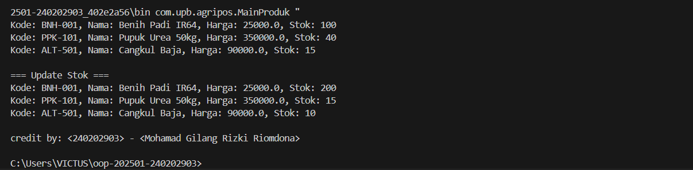

# Laporan Praktikum Minggu 2
Topik: [Class dan Object (Produk Pertanian)]

## Identitas
- Nama  : [Mohamad Gilang Rizki Riomdona]
- NIM   : [240202903]
- Kelas : [IKRB]

---

## Tujuan
- Mahasiswa mampu **menjelaskan konsep class, object, atribut, dan method** dalam OOP.  
- Mahasiswa mampu **menerapkan access modifier dan enkapsulasi** dalam pembuatan class.  
- Mahasiswa mampu **mengimplementasikan class Produk pertanian** dengan atribut dan method yang sesuai.  
- Mahasiswa mampu **mendemonstrasikan instansiasi object** serta menampilkan data produk pertanian di console.  
- Mahasiswa mampu **menyusun laporan praktikum** dengan bukti kode, hasil eksekusi, dan analisis sederhana.  

---

## Dasar Teori
1. Class adalah blueprint dari objek.  
2. Object adalah instansiasi dari class.  
3. Enkapsulasi digunakan untuk menyembunyikan data.)

---

## Langkah Praktikum
(
1. **Membuat Class Produk**
   - Buat file `Produk.java` pada package `model`.
   - Tambahkan atribut: `kode`, `nama`, `harga`, dan `stok`.
   - Gunakan enkapsulasi dengan menjadikan atribut bersifat private dan membuat getter serta setter untuk masing-masing atribut.  

2. **Membuat Class CreditBy**
   - Buat file `CreditBy.java` pada package `util`.
   - Isi class dengan method statis untuk menampilkan identitas mahasiswa di akhir output: `credit by: <NIM> - <Nama>`.

3. **Membuat Objek Produk dan Menampilkan Credit**
   - Buat file `MainProduk.java`.
   - Instansiasi minimal tiga objek produk, misalnya "Benih Padi", "Pupuk Urea", dan satu produk alat pertanian.
   - Tampilkan informasi produk melalui method getter.  
   - Panggil `CreditBy.print("<NIM>", "<Nama>")` di akhir `main` untuk menampilkan identitas.

4. **Commit dan Push**
   - Commit dengan pesan: `week2-class-object`.  
)

---

## Kode Program
(Tuliskan kode utama yang dibuat, contoh:  

```java
// Produk.java
package com.upb.agripos.model;

public class Produk {
    private String kode;
    private String nama;
    private double harga;
    private int stok;

    public Produk(String kode, String nama, double harga, int stok) {
        this.kode = kode;
        this.nama = nama;
        this.harga = harga;
        this.stok = stok;
    }

    public String getKode() { return kode; }
    public void setKode(String kode) { this.kode = kode; }

    public String getNama() { return nama; }
    public void setNama(String nama) { this.nama = nama; }

    public double getHarga() { return harga; }
    public void setHarga(double harga) { this.harga = harga; }

    public int getStok() { return stok; }
    public void setStok(int stok) { this.stok = stok; }

    public void tambahStok(int jumlah) {
        this.stok += jumlah;
    }

    public void kurangiStok(int jumlah) {
        if (this.stok >= jumlah) {
            this.stok -= jumlah;
        } 
        else {
            System.out.println("Stok tidak mencukupi!");
        }
    }
}
//CreditBy.java
package com.upb.agripos.util;

public class CreditBy {
    public static void print(String nim, String nama) {
        System.out.println("\ncredit by: " + nim + " - " + nama);
    }
}
//Mainproduk.java
package com.upb.agripos;

import com.upb.agripos.model.Produk;
import com.upb.agripos.util.CreditBy;

public class MainProduk {
    public static void main(String[] args) {
        Produk p1 = new Produk("BNH-001", "Benih Padi IR64", 25000, 100);
        Produk p2 = new Produk("PPK-101", "Pupuk Urea 50kg", 350000, 40);
        Produk p3 = new Produk("ALT-501", "Cangkul Baja", 90000, 15);

        System.out.println("Kode: " + p1.getKode() + ", Nama: " + p1.getNama() + ", Harga: " + p1.getHarga() + ", Stok: " + p1.getStok());
        System.out.println("Kode: " + p2.getKode() + ", Nama: " + p2.getNama() + ", Harga: " + p2.getHarga() + ", Stok: " + p2.getStok());
        System.out.println("Kode: " + p3.getKode() + ", Nama: " + p3.getNama() + ", Harga: " + p3.getHarga() + ", Stok: " + p3.getStok());

        p1.tambahStok(100);
        p2.kurangiStok(25);
        p3.kurangiStok(5);

        System.out.println("\n=== Update Stok ===");
        System.out.println("Kode: " + p1.getKode() + ", Nama: " + p1.getNama() + ", Harga: " + p1.getHarga() + ", Stok: " + p1.getStok());
        System.out.println("Kode: " + p2.getKode() + ", Nama: " + p2.getNama() + ", Harga: " + p2.getHarga() + ", Stok: " + p2.getStok());
        System.out.println("Kode: " + p3.getKode() + ", Nama: " + p3.getNama() + ", Harga: " + p3.getHarga() + ", Stok: " + p3.getStok());


        // Tampilkan identitas mahasiswa
        CreditBy.print("<240202903>", "<Mohamad Gilang Rizki Riomdona>");
    }
}
```
)
---

## Hasil Eksekusi
(Sertakan screenshot hasil eksekusi program.  

)
---

## Analisis
(
- Jelaskan bagaimana kode berjalan.
   Program tersebut merupakan implementasi sederhana dari konsep Object-Oriented Programming (OOP) menggunakan tiga kelas, yaitu Produk, CreditBy, dan MainProduk. Kelas Produk berfungsi sebagai blueprint atau cetakan untuk membuat objek produk dengan empat atribut utama: kode, nama, harga, dan stok. Kelas ini juga menyediakan getter dan setter agar data produk dapat diakses dan diubah dengan aman. Selain itu, terdapat dua metode tambahan, yaitu tambahStok() untuk menambah jumlah stok dan kurangiStok() untuk mengurangi stok dengan pengecekan agar tidak melebihi jumlah yang tersedia.

   Kelas CreditBy merupakan kelas utilitas yang memiliki metode statis print(), berfungsi untuk menampilkan identitas pembuat program (berisi NIM dan nama). Karena bersifat statis, metode ini dapat dipanggil langsung tanpa membuat objek dari kelas tersebut.

   Selanjutnya, kelas MainProduk berperan sebagai kelas utama yang menjalankan program melalui metode main(). Di dalamnya dibuat tiga objek produk dengan data awal yang berbeda, yaitu benih padi, pupuk urea, dan cangkul baja. Program kemudian menampilkan informasi setiap produk menggunakan metode getter, lalu melakukan perubahan pada stok dengan menambah dan mengurangi jumlah sesuai perintah. Setelah stok diperbarui, program kembali menampilkan kondisi stok terbaru untuk masing-masing produk. Pada bagian akhir, program memanggil metode CreditBy.print() untuk menampilkan identitas mahasiswa pembuat kode. Secara keseluruhan, program ini memperlihatkan bagaimana konsep enkapsulasi dan instansiasi objek bekerja dalam OOP untuk mengelola data produk secara terstruktur dan mudah diatur.
- Apa perbedaan pendekatan minggu ini dibanding minggu sebelumnya. 

   Perbedaan utama antara program minggu ini dan minggu sebelumnya terletak pada pendekatan pemrogramannya serta tingkat penerapan konsep OOP (Object-Oriented Programming).

   Pada minggu sebelumnya, program berfokus pada pengenalan tiga paradigma pemrograman, yaitu prosedural, OOP, dan fungsional. Tujuannya adalah untuk memahami bagaimana sebuah masalah sederhana — menampilkan teks “Hello World” dengan identitas mahasiswa — dapat diselesaikan dengan tiga cara berbeda.

   - Paradigma Prosedural menggunakan urutan langkah-langkah langsung dalam satu fungsi main(). Kode bersifat linear dan tidak      menggunakan konsep objek atau kelas tambahan.

   - Paradigma OOP (Object-Oriented Programming) mulai menerapkan konsep class dan object melalui kelas Mahasiswa. Data (nama dan NIM) serta perilaku (metode sapa()) disatukan dalam satu entitas.

   - Paradigma Fungsional menekankan penggunaan fungsi sebagai objek, seperti pada contoh penggunaan BiConsumer, sehingga kode lebih ringkas dan deklaratif tanpa perlu membuat kelas atau objek secara eksplisit.

   Sementara itu, program minggu ini sudah lebih mendalam dalam menerapkan paradigma OOP secara penuh. Program dibagi ke dalam beberapa kelas dengan tanggung jawab berbeda, seperti Produk sebagai model class, CreditBy sebagai utility class, dan MainProduk sebagai main class. Setiap kelas memiliki atribut, metode, dan perilaku tersendiri yang saling berinteraksi, mencerminkan konsep inti OOP seperti enkapsulasi, instansiasi objek, dan modularitas. Selain hanya menampilkan teks, program minggu ini juga melakukan proses yang lebih kompleks, yaitu mengelola data produk (harga, stok, dan kode) serta memperbarui nilainya melalui metode khusus.

   Dengan demikian, perbedaan mendasarnya adalah bahwa minggu sebelumnya masih berfokus pada perbandingan tiga paradigma secara sederhana, sedangkan minggu ini sudah mengimplementasikan OOP dalam konteks nyata dengan struktur program yang lebih terorganisir, berlapis, dan mencerminkan penerapan konsep kelas dan objek secara praktis.

- Kendala yang dihadapi dan cara mengatasinya.  
   Kendala yang dihadapi dalam praktikum minggu ini terutama berkaitan dengan penggunaan package dan proses import antar file Java. Pada awalnya, program tidak bisa dijalankan karena struktur package belum sesuai dengan letak file di folder proyek. tapi setelah disesuaikan programnya sudah bisa dijalankan
)
---

## Kesimpulan
Kesimpulan dari praktikum minggu ini adalah bahwa penerapan konsep Object-Oriented Programming (OOP) membuat program menjadi lebih terstruktur, modular, dan mudah dikembangkan. Melalui pembagian kelas seperti Produk, CreditBy, dan MainProduk, setiap bagian program memiliki tanggung jawab yang jelas — mulai dari penyimpanan data, pemrosesan logika, hingga tampilan output. Praktikum ini juga memberikan pemahaman tentang pentingnya enkapsulasi, yaitu bagaimana data disimpan secara aman dalam kelas dan hanya dapat diakses melalui metode tertentu. Selain itu, praktikum ini memperkuat pemahaman tentang penggunaan package dan import untuk mengorganisasi kode agar lebih rapi dan profesional. Dengan demikian, mahasiswa tidak hanya memahami dasar teori OOP, tetapi juga mampu mengimplementasikannya dalam program nyata yang melibatkan beberapa kelas dan interaksi antarobjek.*)

---

## Quiz
(1. [Mengapa atribut sebaiknya dideklarasikan sebagai private dalam class? ]  
   **Jawaban:** Karena dengan menjadikan atribut bersifat private, data di dalam class terlindungi dari akses langsung oleh class lain. Hal ini merupakan penerapan prinsip enkapsulasi, yang bertujuan menjaga keamanan dan konsistensi data. Dengan cara ini, perubahan nilai atribut hanya bisa dilakukan melalui metode yang telah disediakan (seperti setter), sehingga mencegah manipulasi data yang tidak diinginkan.

2. [Apa fungsi getter dan setter dalam enkapsulasi?]  
   **Jawaban:** Getter dan setter berfungsi sebagai penghubung antara data dalam class dengan dunia luar. Getter digunakan untuk mengambil atau membaca nilai atribut, sedangkan setter digunakan untuk mengubah atau menetapkan nilai atribut. Keduanya memungkinkan pengontrolan terhadap bagaimana data diakses dan diubah, sehingga menjaga integritas data serta menerapkan prinsip enkapsulasi secara efektif.

3. [Bagaimana cara class `Produk` mendukung pengembangan aplikasi POS yang lebih kompleks?  ]  
   **Jawaban:** Class Produk berperan sebagai model data yang merepresentasikan setiap item yang dijual dalam sistem POS (Point of Sale). Dengan atribut seperti kode, nama, harga, dan stok, serta metode seperti tambahStok() dan kurangiStok(), class ini dapat dengan mudah diperluas untuk mendukung fitur lain seperti perhitungan total penjualan, pengelolaan inventori, dan integrasi dengan modul transaksi. Struktur berbasis OOP ini membuat aplikasi POS lebih mudah dikembangkan, dipelihara, dan diintegrasikan dengan fitur baru di masa depan.
   )
