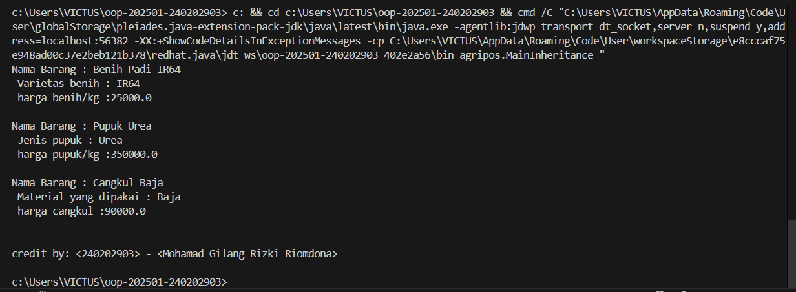

# Laporan Praktikum Minggu 3
Topik: [Inheritance (Kategori Produk)]

## Identitas
- Nama  : [Moahamad Gilang Rizki Riomdona]
- NIM   : [240202903]
- Kelas : [3IKRB]

---

## Tujuan
(
- Mahasiswa mampu menjelaskan konsep inheritance (pewarisan class) dalam OOP.
- Mahasiswa mampu membuat superclass dan subclass untuk produk pertanian.
- Mahasiswa mampu mendemonstrasikan hierarki class melalui contoh kode.
- Mahasiswa mampu menggunakan super untuk memanggil konstruktor dan method parent class.
- Mahasiswa mampu membuat laporan praktikum yang menjelaskan perbedaan penggunaan inheritance dibanding class tunggal.*)

---

## Dasar Teori
(Inheritance adalah mekanisme dalam OOP yang memungkinkan suatu class mewarisi atribut dan method dari class lain.

- Superclass: class induk yang mendefinisikan atribut umum.
- Subclass: class turunan yang mewarisi atribut/method superclass, dan dapat menambahkan atribut/method baru.
- super digunakan untuk memanggil konstruktor atau method superclass.
Dalam konteks Agri-POS, kita dapat membuat class Produk sebagai superclass, kemudian Benih, Pupuk, dan AlatPertanian sebagai subclass. Hal ini membuat kode lebih reusable dan terstruktur.)

---

## Langkah Praktikum
(
1. Membuat Superclass Produk
   - Gunakan class Produk dari Bab 2 sebagai superclass.
2. Membuat Subclass
   - Benih.java → atribut tambahan: varietas.
   - Pupuk.java → atribut tambahan: jenis pupuk (Urea, NPK, dll).
   - AlatPertanian.java → atribut tambahan: material (baja, kayu, plastik).
3. Membuat Main Class
   - Instansiasi minimal satu objek dari tiap subclass.
   - Tampilkan data produk dengan memanfaatkan inheritance.
   - Menambahkan CreditBy

4. Panggil class CreditBy untuk menampilkan identitas mahasiswa.
5. Commit dan Push
   - Commit dengan pesan: week3-inheritance.)

---

## Kode Program
(Tuliskan kode utama yang dibuat, contoh:  

```java
// AlatPertanian.java
package agripos.model;

public class AlatPertanian extends Produk {
    private String material;

    public AlatPertanian(String kode, String nama, double harga, int stok, String material) {
        super(kode, nama, harga, stok);
        this.material = material;
    }

    public String getMaterial() { return material; }
    public void setMaterial(String material) { this.material = material; }
    
    public void deskripsi(){
        System.err.println("Nama Barang : "+ getNama() + "\n Material yang dipakai : " + getMaterial() + "\n harga cangkul :" + getHarga() + "\n");
    }
}

//Benih.java
package agripos.model;

public class Benih extends Produk {
    private String varietas;

    public Benih(String kode, String nama, double harga, int stok, String varietas) {
        super(kode, nama, harga, stok);
        this.varietas = varietas;
    }

    public String getVarietas() { return varietas; }
    public void setVarietas(String varietas) { this.varietas = varietas; }

     public void deskripsi(){
        System.err.println("Nama Barang : "+ getNama() + "\n Varietas benih : " + getVarietas() + "\n harga benih/kg :" + getHarga() + "\n");
    }
}

//Pupuk.java
package agripos.model;

public class Pupuk extends Produk {
    private String jenis;

    public Pupuk(String kode, String nama, double harga, int stok, String jenis) {
        super(kode, nama, harga, stok);
        this.jenis = jenis;
    }

    public String getJenis() { return jenis; }
    public void setJenis(String jenis) { this.jenis = jenis; }

     public void deskripsi(){
        System.err.println("Nama Barang : "+ getNama() + "\n Jenis pupuk : " + getJenis() + "\n harga pupuk/kg :" + getHarga() + "\n");
    }
}

//Produk.java
package agripos.model;

public class Produk {
    private String kode;
    private String nama;
    private double harga;
    private int stok;

    public Produk(String kode, String nama, double harga, int stok) {
        this.kode = kode;
        this.nama = nama;
        this.harga = harga;
        this.stok = stok;
    }

    public String getKode() { return kode; }
    public void setKode(String kode) { this.kode = kode; }

    public String getNama() { return nama; }
    public void setNama(String nama) { this.nama = nama; }

    public double getHarga() { return harga; }
    public void setHarga(double harga) { this.harga = harga; }

    public int getStok() { return stok; }
    public void setStok(int stok) { this.stok = stok; }

    public void tambahStok(int jumlah) {
        this.stok += jumlah;
    }

    public void kurangiStok(int jumlah) {
        if (this.stok >= jumlah) {
            this.stok -= jumlah;
        } 
        else {
            System.out.println("Stok tidak mencukupi!");
        }
    }
}

//CreditBy.java
package agripos.util;

public class CreditBy {
    public static void print(String nim, String nama) {
        System.out.println("\ncredit by: " + nim + " - " + nama);
    }
}

//Mainheritance.java
package agripos;

import agripos.model.AlatPertanian;
import agripos.model.Benih;
import agripos.model.Pupuk;
import agripos.util.CreditBy;

public class MainInheritance {
    public static void main(String[] args) {
        Benih b = new Benih("BNH-001", "Benih Padi IR64", 25000, 100, "IR64");
        Pupuk p = new Pupuk("PPK-101", "Pupuk Urea", 350000, 40, "Urea");
        AlatPertanian a = new AlatPertanian("ALT-501", "Cangkul Baja", 90000, 15, "Baja");

        b.deskripsi();
        p.deskripsi();
        a.deskripsi();

        CreditBy.print("<240202903>", "<Mohamad Gilang Rizki Riomdona>");
    }
}

```
)
---

## Hasil Eksekusi
(Sertakan screenshot hasil eksekusi program.  

)
---

## Analisis
(
- Jelaskan bagaimana kode berjalan.
   Program tersebut merupakan penerapan konsep pewarisan (inheritance) dalam pemrograman berorientasi objek di Java, di mana kelas induk Produk menyimpan atribut umum seperti kode, nama, harga, dan stok, lalu diturunkan ke tiga kelas turunan yaitu Benih, Pupuk, dan AlatPertanian yang masing-masing memiliki atribut khusus (varietas, jenis, dan material). Setiap kelas turunan memiliki metode deskripsi() untuk menampilkan informasi produk secara spesifik di konsol. Dalam kelas utama MainInheritance, dibuat tiga objek dari masing-masing kelas turunan, lalu metode deskripsi() dipanggil untuk menampilkan detail setiap produk. Setelah itu, kelas CreditBy digunakan untuk mencetak identitas pembuat program. Secara keseluruhan, kode ini memperlihatkan bagaimana inheritance memudahkan pengelolaan data yang memiliki kesamaan atribut tetapi berbeda karakteristik, sehingga program menjadi lebih terstruktur, efisien, dan mudah dikembangkan.

- Apa perbedaan pendekatan minggu ini dibanding minggu sebelumnya.  
   Perbedaan utama antara pendekatan minggu ini dan minggu sebelumnya terletak pada penerapan konsep pewarisan (inheritance) dalam pemrograman berorientasi objek.
   Pada minggu sebelumnya, seluruh produk seperti benih, pupuk, dan alat pertanian masih dibuat menggunakan satu kelas tunggal, yaitu Produk. Semua data produk dikelola dalam satu struktur yang sama tanpa perbedaan jenis atau karakteristik khusus. Pendekatan ini memang lebih sederhana, tetapi kurang fleksibel karena setiap jenis produk memiliki ciri unik yang tidak bisa diwakili dengan baik hanya oleh satu kelas.
   Sementara pada minggu ini, program dikembangkan dengan menerapkan inheritance, di mana Produk dijadikan kelas induk (superclass) yang menyimpan atribut dan perilaku umum, sedangkan kelas Benih, Pupuk, dan AlatPertanian dibuat sebagai kelas turunan (subclass) yang menambahkan atribut spesifik seperti varietas, jenis, dan material. Dengan cara ini, kode menjadi lebih modular, mudah dikembangkan, dan mendukung prinsip reusability (kode dapat digunakan ulang tanpa menulis ulang logika yang sama), minggu sebelumnya berfokus pada encapsulation dan penggunaan class dasar, sedangkan minggu ini sudah menerapkan hierarki class dan konsep inheritance, yang membuat struktur program lebih realistis dan mendekati model dunia nyata.

- Kendala yang dihadapi dan cara mengatasinya.  
   Kendala yang saya hadapi saat mengerjakan program minggu ini adalah ketika menuliskan package dan method deskripsi() pada masing-masing kelas. Awalnya, program tidak bisa dijalankan karena terjadi kesalahan pada penulisan struktur package di bagian atas file Java. Saya sempat menempatkan nama package yang tidak sesuai dengan struktur folder sebenarnya, sehingga compiler tidak mengenali letak file dan muncul error “package does not exist”. Selain itu, saya juga mengalami kesulitan saat membuat method deskripsi() di setiap subclass karena masih bingung bagaimana cara mengakses atribut dari superclass menggunakan getter yang sudah ada. Setelah saya pahami bahwa setiap class turunan dapat memanggil metode dari class induk melalui pewarisan (extends), barulah method deskripsi() bisa berjalan dengan baik. Dari kendala ini saya belajar pentingnya menjaga konsistensi struktur package sesuai folder proyek serta memahami konsep pewarisan agar atribut dan method dari superclass dapat digunakan secara benar di subclass.
)
---

## Kesimpulan
(*Kesimpulan dari praktikum minggu ini adalah bahwa penerapan konsep inheritance (pewarisan) dalam pemrograman berorientasi objek memungkinkan kita untuk membuat struktur program yang lebih efisien, terorganisir, dan mudah dikembangkan. Dengan menjadikan Produk sebagai kelas induk yang menyimpan atribut dan perilaku umum, serta membuat kelas turunan seperti Benih, Pupuk, dan AlatPertanian yang memiliki karakteristik khusus, kita dapat menghindari pengulangan kode dan mempermudah pengelolaan data. Praktikum ini juga memperkuat pemahaman tentang cara penggunaan getter, setter, serta pemanggilan konstruktor induk menggunakan super(). Secara keseluruhan, kegiatan ini membantu memahami bagaimana inheritance digunakan untuk menggambarkan hubungan antarobjek yang memiliki kesamaan atribut namun berbeda fungsi dalam dunia nyata.*)

---

## Quiz
(1. [Apa keuntungan menggunakan inheritance dibanding membuat class terpisah tanpa hubungan?]  
   **Jawaban: Keuntungan menggunakan inheritance adalah kita dapat menghindari duplikasi kode karena atribut dan metode yang umum cukup ditulis sekali di kelas induk (superclass), lalu digunakan kembali oleh kelas turunan (subclass). Selain itu, inheritance membuat program lebih terstruktur, mudah dikembangkan, dan mudah dikelola, karena setiap subclass hanya perlu menambahkan fitur atau atribut yang spesifik tanpa harus menulis ulang bagian yang sudah ada di superclass.** …  

2. [Bagaimana cara subclass memanggil konstruktor superclass?]  
   **Jawaban: Subclass dapat memanggil konstruktor dari superclass dengan menggunakan keyword super() di dalam konstruktor subclass. Pemanggilan ini harus dilakukan di baris pertama dalam konstruktor subclass agar atribut dari superclass dapat diinisialisasi terlebih dahulu sebelum atribut subclass.** …  

3. [Berikan contoh kasus di POS pertanian selain Benih, Pupuk, dan Alat Pertanian yang bisa dijadikan subclass.]  
   **Jawaban: Contoh kasus lainnya adalah ObatTanaman, yaitu produk yang digunakan untuk melindungi tanaman dari hama atau penyakit. Kelas ini bisa dijadikan subclass dari Produk dengan atribut tambahan seperti bahanAktif dan tanggalKadaluwarsa. Subclass ini dapat memiliki metode deskripsi() yang menampilkan informasi khusus tentang jenis dan penggunaan obat tanaman tersebut.** )
