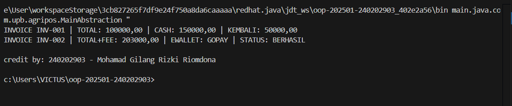

# Laporan Praktikum Minggu 5
Topik: ["abstraction-interface"]

## Identitas
- Nama  : [Mohamad Gilang Rizki Riomdona]
- NIM   : [240202903]
- Kelas : [3 IKRB]

---

## Tujuan
- Mahasiswa mampu **menjelaskan perbedaan abstract class dan interface**.
- Mahasiswa mampu **mendesain abstract class dengan method abstrak** sesuai kebutuhan kasus.
- Mahasiswa mampu **membuat interface dan mengimplementasikannya pada class**.
- Mahasiswa mampu **menerapkan multiple inheritance melalui interface** pada rancangan kelas.
- Mahasiswa mampu **mendokumentasikan kode** (komentar kelas/method, README singkat pada folder minggu).

---

## Dasar Teori
**Abstraksi** adalah proses menyederhanakan kompleksitas dengan menampilkan elemen penting dan menyembunyikan detail implementasi.
- **Abstract class**: tidak dapat diinstansiasi, dapat memiliki method abstrak (tanpa badan) dan non-abstrak. Dapat menyimpan state (field).
- **Interface**: kumpulan kontrak (method tanpa implementasi konkret). Sejak Java 8 mendukung default method. Mendukung **multiple inheritance** (class dapat mengimplementasikan banyak interface).
- Gunakan **abstract class** bila ada _shared state_ dan perilaku dasar; gunakan **interface** untuk mendefinisikan kemampuan/kontrak lintas hierarki.

Dalam konteks Agri-POS, **Pembayaran** dapat dimodelkan sebagai abstract class dengan method abstrak `prosesPembayaran()` dan `biaya()`. Implementasi konkritnya: `Cash` dan `EWallet`. Kemudian, interface seperti `Validatable` (mis. verifikasi OTP) dan `Receiptable` (mencetak bukti) dapat diimplementasikan oleh jenis pembayaran yang relevan.

---

1. **Abstract Class – Pembayaran**
   - Buat `Pembayaran` (abstract) dengan field `invoiceNo`, `total` dan method:
     - `double biaya()` (abstrak) → biaya tambahan (fee).
     - `boolean prosesPembayaran()` (abstrak) → mengembalikan status berhasil/gagal.
     - `double totalBayar()` (konkrit) → `return total + biaya();`.

2. **Subclass Konkret**
   - `Cash` → biaya = 0, proses = selalu berhasil jika `tunai >= totalBayar()`.
   - `EWallet` → biaya = 1.5% dari `total`; proses = membutuhkan validasi.

3. **Interface**
   - `Validatable` → `boolean validasi();` (contoh: OTP).
   - `Receiptable` → `String cetakStruk();`

4. **Multiple Inheritance via Interface**
   - `EWallet` mengimplementasikan **dua interface**: `Validatable`, `Receiptable`.
   - `Cash` setidaknya mengimplementasikan `Receiptable`.

5. **Main Class**
    - Buat `MainAbstraction.java` untuk mendemonstrasikan pemakaian `Pembayaran` (polimorfik).
    - Tampilkan hasil proses dan struk. Di akhir, panggil `CreditBy.print("[NIM]", "[Nama]")`.

6. **Commit dan Push**
   - Commit dengan pesan: `week5-abstraction-interface`.

---

## Kode Program
(
```java

//Pembayaran.java 
package main.java.com.upb.agripos.model.pembayaran;

public abstract class Pembayaran {
    protected String invoiceNo;
    protected double total;

    public Pembayaran(String invoiceNo, double total) {
        this.invoiceNo = invoiceNo;
        this.total = total;
    }

    public abstract double biaya();
    public abstract boolean prosesPembayaran();

    public double totalBayar() {
        return total + biaya();
    }

    public String getInvoiceNo() { return invoiceNo; }
    public double getTotal() { return total; }
}

//EWallet.java
package main.java.com.upb.agripos.model.pembayaran;

import main.java.com.upb.agripos.model.kontrak.Receiptable;
import main.java.com.upb.agripos.model.kontrak.Validatable;

public class EWallet extends Pembayaran implements Validatable, Receiptable {

    private String akun;
    private String otp;

    public EWallet(String invoiceNo, double total, String akun, String otp) {
        super(invoiceNo, total);
        this.akun = akun;
        this.otp = otp;
    }

    @Override
    public double biaya() {
        return total * 0.015;
    }

    @Override
    public boolean validasi() {
        return otp != null && otp.length() == 6;
    }

    @Override
    public boolean prosesPembayaran() {
        return validasi();
    }

    @Override
    public String cetakStruk() {
        return String.format(
            "INVOICE %s | TOTAL+FEE: %.2f | EWALLET: %s | STATUS: %s",
            invoiceNo, totalBayar(), akun,
            prosesPembayaran() ? "BERHASIL" : "GAGAL"
        );
    }
}

//Cash.java
package main.java.com.upb.agripos.model.pembayaran;


import main.java.com.upb.agripos.model.kontrak.Receiptable;

public class Cash extends Pembayaran implements Receiptable {

    private double tunai;

    public Cash(String invoiceNo, double total, double tunai) {
        super(invoiceNo, total);
        this.tunai = tunai;
    }

    @Override
    public double biaya() {
        return 0;
    }

    @Override
    public boolean prosesPembayaran() {
        return tunai >= totalBayar();
    }

    @Override
    public String cetakStruk() {
        return String.format(
            "INVOICE %s | TOTAL: %.2f | CASH: %.2f | KEMBALI: %.2f",
            invoiceNo, totalBayar(), tunai, Math.max(0, tunai - totalBayar())
        );
    }
}

//Receiptable.java
package main.java.com.upb.agripos.model.kontrak;

public interface Receiptable {
    String cetakStruk();
}

//Validatable.java
package main.java.com.upb.agripos.model.kontrak;

public interface Validatable {
    boolean validasi();
}

//CreditBy.java
package main.java.com.upb.agripos.util;

public class CreditBy {
    public static void print(String nim, String nama) {
        System.out.println("\ncredit by: " + nim + " - " + nama);
    }
}

//MainAbstraction.java
package main.java.com.upb.agripos;

import main.java.com.upb.agripos.model.kontrak.Receiptable;
import main.java.com.upb.agripos.model.pembayaran.Cash;
import main.java.com.upb.agripos.model.pembayaran.EWallet;
import main.java.com.upb.agripos.model.pembayaran.Pembayaran;
import main.java.com.upb.agripos.util.CreditBy;

public class MainAbstraction {
    public static void main(String[] args) {

        Pembayaran cash = new Cash("INV-001", 100000, 150000);
        Pembayaran ew   = new EWallet("INV-002", 200000, "GOPAY", "123456");

        // menggunakan interface
        System.out.println(((Receiptable) cash).cetakStruk());
        System.out.println(((Receiptable) ew).cetakStruk());

        CreditBy.print("240202903", "Mohamad Gilang Rizki Riomdona");
    }
}
```
)
---

## Hasil Eksekusi
(Sertakan screenshot hasil eksekusi program.  

)
---

## Analisis
(
- Jelaskan bagaimana kode berjalan.  
    Program dimulai dari kelas MainAbstraction yang membuat dua objek pembayaran, yaitu Cash dan EWallet, keduanya disimpan dalam tipe abstrak Pembayaran. Ketika objek dibuat, konstruktor di kelas Pembayaran dijalankan terlebih dahulu untuk mengisi nomor invoice dan total pembayaran, kemudian konstruktor masing-masing subclass mengisi atribut tambahan seperti jumlah uang tunai untuk Cash dan akun serta kode OTP untuk EWallet. Pada objek Cash, biaya tambahan selalu nol, sehingga total yang harus dibayar sama dengan total awal, sementara proses pembayaran dinyatakan berhasil jika uang tunai yang diberikan lebih besar atau sama dengan total yang harus dibayar. Pada EWallet, biaya tambahan dihitung sebesar 1.5% dari total, dan proses pembayaran dianggap berhasil jika OTP yang diberikan valid, yaitu tidak null dan memiliki panjang enam karakter. Kedua objek ini mengimplementasikan interface Receiptable, sehingga masing-masing wajib menyediakan method cetakStruk() yang menghasilkan struk sesuai jenis pembayarannya. Di dalam main, objek-objek tersebut dipaksa menjadi tipe Receiptable dan dipanggil method cetakStruk()-nya, sehingga program menampilkan struk pembayaran cash beserta kembalian, dan struk e-wallet beserta status validasinya. Pada akhir eksekusi, program juga memanggil kelas utilitas CreditBy untuk menampilkan informasi pembuat program.


- Apa perbedaan pendekatan minggu ini dibanding minggu sebelumnya.  
    Pendekatan minggu ini memiliki perbedaan yang cukup jelas dibandingkan minggu sebelumnya karena fokus konsep OOP yang digunakan berbeda. Minggu lalu, program berfokus pada polymorphism dalam konteks inheritance, yakni bagaimana kelas induk Produk diturunkan menjadi berbagai kelas turunan seperti Benih, Pupuk, AlatPertanian, dan ObatHama. Setiap subclass melakukan override terhadap method getInfo() sehingga ketika objek-objek tersebut dimasukkan ke dalam array bertipe Produk, pemanggilan getInfo() tetap menghasilkan output sesuai jenis produk masing-masing. Konsep utama yang ditonjolkan adalah dynamic binding, yaitu pemanggilan method berdasarkan objek asli, bukan tipe referensinya. Dengan kata lain, minggu lalu menekankan polimorfisme berbasis class inheritance.

    Sementara itu, minggu ini pendekatannya berbeda karena fokusnya adalah pada abstraksi dan penggunaan interface. Kelas Pembayaran dijadikan abstract class sehingga hanya menyediakan kerangka umum (seperti biaya(), prosesPembayaran(), totalBayar()), dan detail implementasi diserahkan kepada subclass seperti Cash dan EWallet. Selain pewarisan, minggu ini juga memperkenalkan banyak interface seperti Validatable dan Receiptable untuk memaksa kelas tertentu menyediakan fungsi tambahan seperti validasi OTP atau pencetakan struk. Pada minggu ini objek tidak diperlakukan hanya melalui superclass, tetapi juga melalui interface yang memberikan kemampuan tambahan dan memperlihatkan bagaimana Java mendukung multiple abstraction melalui kombinasi abstract class dan interface.

- Kendala yang dihadapi dan cara mengatasinya.  
    Kendala yang saya hadapi selama praktikum adalah ketika membuat file Java baru, deklarasi package tidak muncul secara otomatis. Hal ini terjadi karena file tersebut tidak dibuat langsung di dalam folder yang telah diatur sebagai struktur package Java, sehingga editor seperti VS Code tidak mengenali lokasi file sebagai bagian dari package yang benar. Akibatnya, setiap file baru tidak langsung mendapatkan baris package ...; di bagian atas. Selain itu, struktur folder project sempat belum sesuai format standar Java, sehingga sistem tidak dapat menghubungkan file dengan package yang seharusnya. Setelah memastikan file dibuat langsung di dalam folder package yang tepat dan melakukan reload pada workspace, barulah deklarasi package dapat muncul secara normal. Kendala ini cukup menghambat proses awal karena saya harus memeriksa ulang posisi file agar sesuai dengan struktur project.
)
---

## Kesimpulan
( *Kesimpulan dari praktikum minggu ini adalah bahwa penggunaan abstraction dan interface memberikan struktur yang lebih jelas dalam membangun suatu sistem program berbasis objek. Melalui abstract class Pembayaran, saya memahami bagaimana sebuah kelas dapat menyediakan kerangka dasar yang harus diikuti oleh setiap subclass, seperti perhitungan biaya dan proses pembayaran. Sementara itu, interface seperti Receiptable dan Validatable memberikan fleksibilitas tambahan karena memungkinkan suatu kelas memiliki kemampuan tertentu tanpa terikat pada pewarisan tunggal. Penerapan kedua konsep ini menunjukkan bagaimana Java menggabungkan abstraksi dan kontrak perilaku untuk menghasilkan desain yang lebih rapi, terorganisir, dan mudah diperluas. Praktikum ini juga membantu memperkuat pemahaman tentang polimorfisme, terutama ketika objek diakses melalui interface untuk menjalankan method yang telah diimplementasikan oleh subclass masing-masing. Secara keseluruhan, materi minggu ini memberikan pemahaman yang lebih mendalam tentang bagaimana merancang kode yang modular, fleksibel, dan mudah dikembangkan.*)

---

## Quiz
(1. [Jelaskan perbedaan konsep dan penggunaan **abstract class** dan **interface**.]  
   **Jawaban:Abstract class digunakan ketika sebuah kelas ingin menyediakan kerangka dasar beserta beberapa implementasi yang dapat langsung digunakan oleh subclass. Dengan abstract class, kita dapat memiliki field, constructor, dan method yang sudah terisi, sekaligus method abstract yang wajib dioverride. Sementara itu, interface berfungsi sebagai kontrak perilaku yang harus dimiliki oleh kelas yang mengimplementasikannya. Interface tidak menyediakan keadaan objek (state) dan tidak memiliki constructor, tetapi hanya berisi kumpulan method yang wajib diimplementasikan oleh kelas lain. Dari sisi penggunaan, abstract class dipakai ketika beberapa kelas memiliki hubungan “is a” yang kuat dan berbagi logika dasar yang sama, sedangkan interface digunakan ketika beberapa kelas membutuhkan “kemampuan tambahan” tertentu tanpa harus berada dalam satu garis keturunan.**

2. [Mengapa **multiple inheritance** lebih aman dilakukan dengan interface pada Java?  ]  
   **Jawaban:Multiple inheritance pada Java lebih aman dilakukan menggunakan interface karena interface tidak membawa state dan tidak memiliki implementasi kompleks yang bisa menimbulkan konflik saat diwarisi oleh beberapa kelas sekaligus. Jika Java mengizinkan pewarisan ganda pada class, maka dua class induk dapat membawa field atau method dengan implementasi berbeda, yang kemudian menghasilkan masalah ambigu—sering disebut diamond problem. Dengan interface, Java menghindari konflik tersebut karena yang diwariskan hanyalah deklarasi method, bukan implementasinya. Hal ini membuat kelas dapat mengimplementasikan banyak interface tanpa risiko tabrakan logika atau pewarisan state, sehingga lebih aman dan tetap menjaga struktur kode tetap bersih.**

3. [Pada contoh Agri-POS, bagian mana yang **paling tepat** menjadi abstract class dan mana yang menjadi interface? Jelaskan alasannya.]  
   **Jawaban:Pada contoh Agri-POS, kelas Pembayaran adalah bagian yang paling tepat dijadikan abstract class, karena seluruh jenis pembayaran seperti Cash dan EWallet memiliki struktur dan perilaku dasar yang sama, misalnya perhitungan total, biaya tambahan, dan proses pembayaran. Abstract class memungkinkan kita menyediakan constructor dan method umum (totalBayar()) yang dapat langsung digunakan oleh subclass, sambil tetap memaksa subclass untuk mengimplementasikan method tertentu seperti biaya() dan prosesPembayaran(). Sementara itu, interface seperti Receiptable dan Validatable sangat tepat digunakan sebagai interface karena keduanya merepresentasikan kemampuan tambahan yang tidak harus dimiliki semua jenis pembayaran. Misalnya tidak semua pembayaran butuh validasi OTP dan tidak semua butuh mencetak struk. Dengan penggunaan interface, kelas pembayaran dapat memilih kemampuan apa yang ingin mereka implementasikan tanpa harus memaksakan semuanya ke setiap subclass.** )
