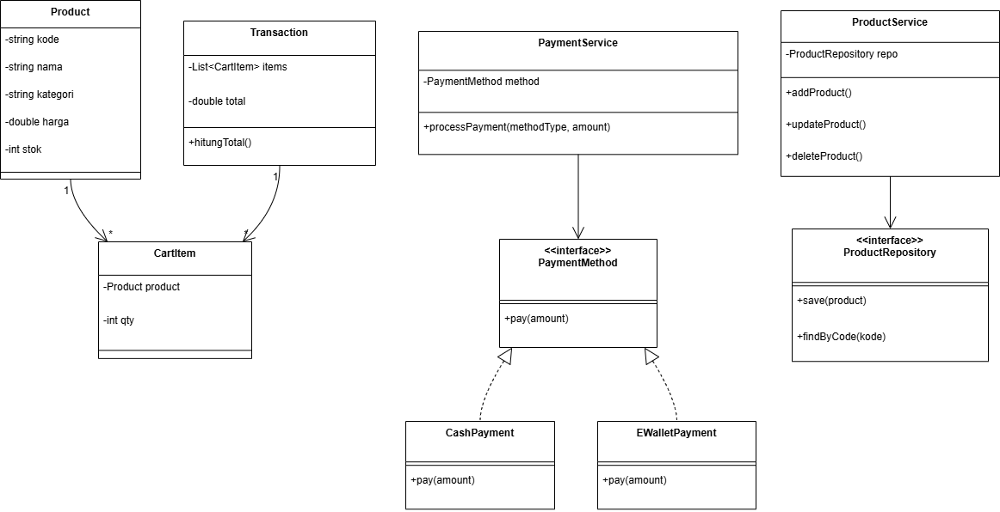
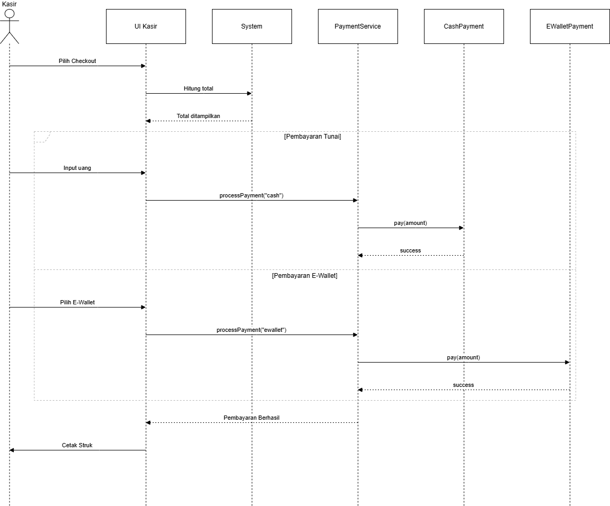
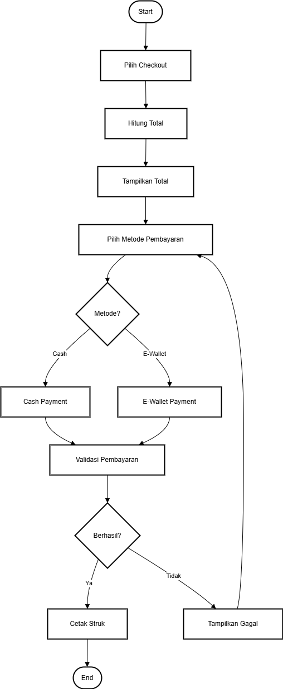

# Laporan Praktikum Minggu 1 (sesuaikan minggu ke berapa?)
Topik: [Desain Arsitektur Sistem dengan UML dan Prinsip SOLID]

## Identitas
- Nama  : [Mohamad Gilang Rizki Riomdona]
- NIM   : [240202903]
- Kelas : [3IKRB]

---

## Tujuan
(1. Mahasiswa mampu mengidentifikasi kebutuhan sistem ke dalam diagram UML.
2. Mahasiswa mampu menggambar UML Class Diagram dengan relasi antar class yang tepat.
3. Mahasiswa mampu menjelaskan prinsip desain OOP (SOLID).
4. Mahasiswa mampu menerapkan minimal dua prinsip SOLID dalam kode program.
*)

---

## Dasar Teori
(Tuliskan ringkasan teori singkat (3–5 poin) yang mendasari praktikum.  
Contoh:  
1. Class adalah blueprint dari objek.  
2. Object adalah instansiasi dari class.  
3. Enkapsulasi digunakan untuk menyembunyikan data.)

---

## Langkah Praktikum
(## Kebutuhan Sistem

### A. Functional Requirements

1. **Manajemen Produk**
   Sistem dapat menambah, mengubah, menghapus, dan menampilkan data produk pertanian (benih, pupuk, alat, obat).
   Produk memiliki atribut: `kode`, `nama`, `kategori`, `harga`, dan `stok`.

2. **Transaksi Penjualan**
   Kasir dapat membuat transaksi baru, menambahkan produk ke keranjang, menghitung total, dan menyelesaikan pembayaran.

3. **Metode Pembayaran**
   Sistem mendukung pembayaran tunai dan e-wallet. Di masa depan, metode lain seperti transfer bank harus dapat ditambahkan tanpa mengubah kode lama.

4. **Pencetakan Struk dan Laporan**
   Setelah pembayaran berhasil, sistem menampilkan atau mencetak struk.
   Admin dapat melihat laporan penjualan harian atau periodik.

5. **Login dan Hak Akses**
   Kasir dan admin memiliki hak akses berbeda (kasir untuk transaksi, admin untuk produk dan laporan).

---

### B. Non-Functional Requirements

1. **Maintainability** – Struktur kode mengikuti prinsip **Single Responsibility** dan **Dependency Inversion**.
2. **Extensibility** – Penambahan fitur baru tidak mengubah class inti (Open/Closed).
3. **Reusability** – Menggunakan **interface** dan **abstraksi** agar mudah diuji.
4. **Consistency** – Penamaan dan dokumentasi konsisten antar komponen.
5. **Documentability** – Semua desain didokumentasikan dalam empat diagram UML.
)

---
---

## Hasil Eksekusi
(Sertakan screenshot hasil eksekusi program.  

)
---

## Analisis
(
Desain arsitektur sistem Agri-POS disusun menggunakan pendekatan UML untuk memastikan kebutuhan fungsional dan non-fungsional sistem terpenuhi secara terstruktur dan konsisten. Use Case Diagram menggambarkan interaksi utama antara aktor Kasir dan Admin, di mana kasir berfokus pada proses transaksi dan pembayaran, sedangkan admin menangani pengelolaan produk serta laporan penjualan. Activity Diagram menunjukkan alur proses checkout secara menyeluruh mulai dari pemilihan transaksi, perhitungan total, pemilihan metode pembayaran hingga pencetakan struk, termasuk penanganan kondisi alternatif seperti kegagalan pembayaran. Sequence Diagram memperjelas interaksi antar objek selama proses pembayaran dengan memisahkan alur pembayaran tunai dan e-wallet menggunakan mekanisme alternatif, sehingga logika sistem mudah dipahami dan ditelusuri. Class Diagram dirancang dengan pemisahan tanggung jawab yang jelas, di mana entitas bisnis, layanan, dan abstraksi pembayaran dipisahkan melalui penggunaan interface dan service layer. Penerapan prinsip SOLID terlihat melalui Single Responsibility pada setiap kelas, Open/Closed dan Liskov Substitution pada penambahan metode pembayaran baru tanpa mengubah kode yang ada, serta Dependency Inversion dengan ketergantungan pada interface, sehingga desain sistem bersifat modular, mudah dikembangkan, dan maintainable. 
)
---

---