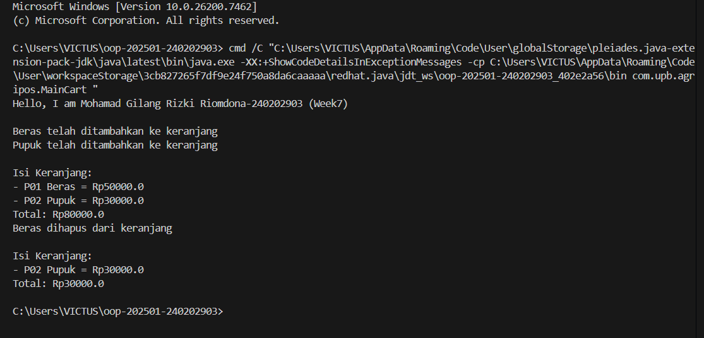

# Laporan Praktikum Minggu 7
Topik: [Collections dan Implementasi Keranjang Belanja]

## Identitas
- Nama  : [Mohamad Gilang Rizki Riomdona]
- NIM   : [240202903]
- Kelas : [3IKRB]

---

## Tujuan
( Mahasiswa mampu:

1. Menjelaskan konsep collection dalam Java (List, Map, Set).
2. Menggunakan ArrayList untuk menyimpan dan mengelola objek.
3. Mengimplementasikan Map atau Set sesuai kebutuhan pengelolaan data.
4. Melakukan operasi dasar pada collection: tambah, hapus, dan hitung total.
5. Menganalisis efisiensi penggunaan collection dalam konteks sistem Agri-POS.
)

---

## Dasar Teori
(Tuliskan ringkasan teori singkat (3–5 poin) yang mendasari praktikum.  
Contoh:  
### 1. Collections Framework

Java Collections Framework menyediakan struktur data untuk mengelola objek secara dinamis dan efisien.

Struktur utama:

- List (implementasi: ArrayList) — Terurut, dapat menyimpan elemen duplikat.
- Map (implementasi: HashMap) — Menyimpan pasangan key–value, akses cepat berdasarkan key.
- Set (implementasi: HashSet) — Tidak menerima duplikat dan tidak mempertahankan urutan.

---

### 2. Studi Kasus: Keranjang Belanja Agri-POS

Keranjang belanja harus dapat:

- Menambahkan produk
- Menghapus produk
- Menampilkan isi keranjang
- Menghitung total nilai transaksi
- Menangani jumlah (quantity) menggunakan Map

Kasus ini mencerminkan penggunaan struktur data dalam aplikasi nyata seperti POS.
)

---

## Langkah Praktikum
(
1. Membuat Class Product.
2. Implementasi Keranjang dengan ArrayList. 
3. Main Program (WAJIB DIISI)
4. Implementasi Alternatif Menggunakan Map (Dengan Quantity) 
5. Commit message yang digunakan.)

---

## Kode Program
(Tuliskan kode utama yang dibuat, contoh:  

```java
// Product.java
package com.upb.agripos;

public class Product {
    private final String code;
    private final String name;
    private final double price;

    public Product(String code, String name, double price) {
        this.code = code;
        this.name = name;
        this.price = price;
    }

    public String getCode() {
        return code;
    }

    public String getName() {
        return name;
    }

    public double getPrice() {
        return price;
    }
}

//MainCart.java
package com.upb.agripos;

public class MainCart {
    public static void main(String[] args) {
        System.out.println("Hello, I am Nice-22123456 (Week7)\n");

        Product p1 = new Product("P01", "Beras", 50000);
        Product p2 = new Product("P02", "Pupuk", 30000);

        ShoppingCart cart = new ShoppingCart();

        cart.addProduct(p1);
        cart.addProduct(p2);

        cart.printCart();

        cart.removeProduct(p1);
        cart.printCart();
    }
}
//ShoppingCart.java
package com.upb.agripos;

import java.util.ArrayList;

public class ShoppingCart {
    private final ArrayList<Product> items = new ArrayList<>();

    public void addProduct(Product p) {
        items.add(p);
        System.out.println(p.getName() + " telah ditambahkan ke keranjang");
    }

    public void removeProduct(Product p) {
        if (items.remove(p)) {
            System.out.println(p.getName() + " dihapus dari keranjang");
        }
    }

    public double getTotal() {
        double total = 0;
        for (Product p : items) {
            total += p.getPrice();
        }
        return total;
    }

    public void printCart() {
        System.out.println("\nIsi Keranjang:");
        for (Product p : items) {
            System.out.println("- " + p.getCode() + " " + p.getName()
                    + " = Rp" + p.getPrice());
        }
        System.out.println("Total: Rp" + getTotal());
    }
}

//ShoppingCartMap.java
package com.upb.agripos;

import java.util.HashMap;
import java.util.Map;

public class ShoppingCartMap {
    private final Map<Product, Integer> items = new HashMap<>();

    public void addProduct(Product p) {
        items.put(p, items.getOrDefault(p, 0) + 1);
    }

    public void removeProduct(Product p) {
        if (!items.containsKey(p)) {
            return;
        }

        int qty = items.get(p);
        if (qty > 1) {
            items.put(p, qty - 1);
        } else {
            items.remove(p);
        }
    }

    public double getTotal() {
        double total = 0;
        for (Map.Entry<Product, Integer> entry : items.entrySet()) {
            total += entry.getKey().getPrice() * entry.getValue();
        }
        return total;
    }

    public void printCart() {
        System.out.println("Isi Keranjang (Map):");
        for (Map.Entry<Product, Integer> e : items.entrySet()) {
            System.out.println(
                "- " + e.getKey().getCode() + " " +
                e.getKey().getName() + " x" + e.getValue()
            );
        }
        System.out.println("Total: " + getTotal());
    }
}

```
)
---

## Hasil Eksekusi
(Sertakan screenshot hasil eksekusi program.  

)
---

## Analisis
(
- Jelaskan bagaimana kode berjalan.  
Program dimulai dari class MainCart sebagai entry point. Pada class ini dibuat beberapa objek Product yang merepresentasikan data produk. Objek-objek tersebut kemudian dimasukkan ke dalam keranjang belanja melalui method addProduct() pada class ShoppingCart.
Data produk disimpan dalam ArrayList, sehingga dapat dikelola secara dinamis. Program menampilkan isi keranjang menggunakan perulangan, serta menghitung total harga dengan menjumlahkan harga setiap produk yang ada di dalam keranjang. Saat produk dihapus menggunakan removeProduct(), isi keranjang dan total harga akan diperbarui secara otomatis.
- Apa perbedaan pendekatan minggu ini dibanding minggu sebelumnya.  
- Kendala yang dihadapi dan cara mengatasinya.  
Kendala utama yang dihadapi adalah memahami cara kerja collection dalam Java, khususnya saat menambahkan, menghapus, dan mengakses data di dalam ArrayList dan Map. Selain itu, penyesuaian output agar mudah dipahami pengguna juga menjadi tantangan.
Kendala tersebut diatasi dengan mempelajari struktur collection, menggunakan perulangan untuk mengakses data, serta menambahkan pesan output yang singkat dan jelas agar alur program lebih mudah dipahami.
)
---

## Kesimpulan
(Dengan menggunakan Java Collections Framework, program keranjang belanja dapat mengelola data produk secara dinamis dan efisien. Penggunaan ArrayList dan Map membuat program lebih fleksibel, terstruktur, dan mudah dikembangkan untuk kebutuhan sistem Agri-POS di masa mendatang.*)

---

## Quiz
(1. [Jelaskan perbedaan mendasar antara List, Map, dan Set.]  
   **Jawaban:** List adalah struktur data yang menyimpan kumpulan elemen secara berurutan dan memperbolehkan adanya elemen duplikat, sehingga cocok digunakan ketika urutan data penting. Set adalah struktur data yang menyimpan kumpulan elemen unik dan tidak memperbolehkan duplikasi, sehingga sesuai untuk data yang tidak boleh berulang. Sementara itu, Map menyimpan pasangan key–value, di mana setiap key bersifat unik dan digunakan untuk mengakses value tertentu secara efisien. 

2. [Mengapa ArrayList cocok digunakan untuk keranjang belanja sederhana?]  
   **Jawaban:** ArrayList cocok digunakan untuk keranjang belanja sederhana karena mendukung penyimpanan data secara berurutan, mudah dalam penambahan dan penghapusan item, serta memungkinkan adanya produk yang sama lebih dari satu kali. Selain itu, ArrayList memiliki akses indeks yang cepat sehingga memudahkan sistem dalam menampilkan dan mengelola daftar item dalam keranjang belanja. 

3. [Bagaimana struktur Set mencegah duplikasi data?]  
   **Jawaban:** Struktur Set mencegah duplikasi data dengan memanfaatkan mekanisme pengecekan kesamaan elemen, biasanya melalui metode equals() dan hashCode() pada objek yang disimpan. Ketika sebuah elemen baru ditambahkan, Set akan memeriksa apakah elemen tersebut sudah ada; jika sudah ada, maka elemen tersebut tidak akan ditambahkan ke dalam koleksi.

4. [Kapan sebaiknya menggunakan Map dibandingkan List? Jelaskan dengan contoh.]  
   **Jawaban:** Map sebaiknya digunakan ketika data perlu diakses berdasarkan kunci tertentu yang unik, bukan berdasarkan urutan. Contohnya, dalam sistem kasir, data produk dapat disimpan dalam Map dengan kodeProduk sebagai key dan objek Produk sebagai value, sehingga pencarian produk berdasarkan kode dapat dilakukan dengan cepat tanpa harus menelusuri seluruh data seperti pada List.  )
