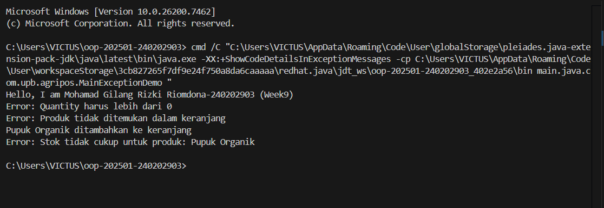

# Laporan Praktikum Minggu 1 (sesuaikan minggu ke berapa?)
Topik: [Exception Handling, Custom Exception, dan Penerapan Design Pattern]

## Identitas
- Nama  : [Mohamad Gilang Rizki Riomdona]
- NIM   : [240202903]
- Kelas : [3IKRB]

---

## Tujuan
(Mahasiswa mampu:

1. Menjelaskan perbedaan antara error dan exception.
2. Mengimplementasikan try–catch–finally dengan tepat.
3. Membuat custom exception sesuai kebutuhan program.
4. Mengintegrasikan exception handling ke dalam aplikasi sederhana (kasus keranjang belanja).
5. (Opsional) Menerapkan design pattern sederhana (Singleton/MVC) dan unit testing dasar.
*)

---

## Dasar Teori
(### 1. Error vs Exception

- Error → kondisi fatal, tidak dapat ditangani (contoh: OutOfMemoryError).
- Exception → kondisi tidak normal yang dapat ditangani oleh program.

### 2. Struktur try–catch–finally

```java
try {
    // kode yang berpotensi menimbulkan kesalahan
} catch (Exception e) {
    // penanganan
} finally {
    // blok yang selalu dijalankan
}
```

### 3. Membuat Custom Exception

```java
package com.upb.agripos;

public class InvalidQuantityException extends Exception {
    public InvalidQuantityException(String message) {
        super(message);
    }
}
```

---

## Studi Kasus Agri-POS: Keranjang Belanja

Keranjang belanja harus memvalidasi:

- Jumlah pembelian > 0
- Produk ada dalam keranjang
- Stok mencukupi

Kesalahan–kesalahan tersebut ditangani menggunakan custom exception.
)

---

## Langkah Praktikum
(### 1. Membuat Custom Exception

```java
package com.upb.agripos;

public class InvalidQuantityException extends Exception {
    public InvalidQuantityException(String msg) { super(msg); }
}
```

```java
package com.upb.agripos;

public class ProductNotFoundException extends Exception {
    public ProductNotFoundException(String msg) { super(msg); }
}
```

```java
package com.upb.agripos;

public class InsufficientStockException extends Exception {
    public InsufficientStockException(String msg) { super(msg); }
}
```

### 2. Model Product dengan Stok

```java
package com.upb.agripos;

public class Product {
    private final String code;
    private final String name;
    private final double price;
    private int stock;

    public Product(String code, String name, double price, int stock) {
        this.code = code;
        this.name = name;
        this.price = price;
        this.stock = stock;
    }

    public String getCode() { return code; }
    public String getName() { return name; }
    public double getPrice() { return price; }
    public int getStock() { return stock; }
    public void reduceStock(int qty) { this.stock -= qty; }
}
```

### 3. Implementasi ShoppingCart dengan Exception Handling

```java
package com.upb.agripos;

import java.util.HashMap;
import java.util.Map;

public class ShoppingCart {
    private final Map<Product, Integer> items = new HashMap<>();

    public void addProduct(Product p, int qty) throws InvalidQuantityException {
        if (qty <= 0) {
            throw new InvalidQuantityException("Quantity harus lebih dari 0.");
        }
        items.put(p, items.getOrDefault(p, 0) + qty);
    }

    public void removeProduct(Product p) throws ProductNotFoundException {
        if (!items.containsKey(p)) {
            throw new ProductNotFoundException("Produk tidak ada dalam keranjang.");
        }
        items.remove(p);
    }

    public void checkout() throws InsufficientStockException {
        for (Map.Entry<Product, Integer> entry : items.entrySet()) {
            Product product = entry.getKey();
            int qty = entry.getValue();
            if (product.getStock() < qty) {
                throw new InsufficientStockException(
                    "Stok tidak cukup untuk: " + product.getName()
                );
            }
        }
        // contoh pengurangan stok bila semua cukup
        for (Map.Entry<Product, Integer> entry : items.entrySet()) {
            entry.getKey().reduceStock(entry.getValue());
        }
    }
}
```

### 4. Main Program untuk Menguji Exception Handling

```java
package com.upb.agripos;

public class MainExceptionDemo {
    public static void main(String[] args) {
        System.out.println("Hello, I am [Nama]-[NIM] (Week9)");

        ShoppingCart cart = new ShoppingCart();
        Product p1 = new Product("P01", "Pupuk Organik", 25000, 3);

        try {
            cart.addProduct(p1, -1);
        } catch (InvalidQuantityException e) {
            System.out.println("Kesalahan: " + e.getMessage());
        }

        try {
            cart.removeProduct(p1);
        } catch (ProductNotFoundException e) {
            System.out.println("Kesalahan: " + e.getMessage());
        }

        try {
            cart.addProduct(p1, 5);
            cart.checkout();
        } catch (Exception e) {
            System.out.println("Kesalahan: " + e.getMessage());
        }
    }
}
```

---

## Design Pattern Sederhana

### 1. Singleton Pattern

Digunakan untuk layanan yang hanya boleh ada satu instance, misalnya ProductService.

```java
package com.upb.agripos;

public class ProductService {
    private static ProductService instance;
    private ProductService() {}

    public static ProductService getInstance() {
        if (instance == null) { instance = new ProductService(); }
        return instance;
    }
}
```

### 2. Konsep MVC

- Model → Product, ShoppingCart
- View → tampilkan output terminal
- Controller → MainExceptionDemo
)

---

## Kode Program
(

```java
// InsufficientStockException.java
package main.java.com.upb.agripos;

public class InsufficientStockException extends Exception {
    public InsufficientStockException(String message) {
        super(message);
    }
}

//InvalidQuantityException.java
package main.java.com.upb.agripos;

public class InvalidQuantityException extends Exception {
    public InvalidQuantityException(String message) {
        super(message);
    }
}

//MainExceptionDemo.java
package main.java.com.upb.agripos;

public class MainExceptionDemo {

    public static void main(String[] args) {

        System.out.println("Hello, I am Mohamad Gilang Rizki Riomdona-240202903 (Week9)");

        ShoppingCart cart = new ShoppingCart();
        Product pupuk = new Product(
                "P01",
                "Pupuk Organik",
                25000,
                3
        );

        // 1. Uji qty tidak valid
        try {
            cart.addProduct(pupuk, -1);
        } catch (InvalidQuantityException e) {
            System.out.println("Error: " + e.getMessage());
        }

        // 2. Uji hapus produk yang belum ada
        try {
            cart.removeProduct(pupuk);
        } catch (ProductNotFoundException e) {
            System.out.println("Error: " + e.getMessage());
        }

        // 3. Uji stok tidak cukup
        try {
            cart.addProduct(pupuk, 5);
            cart.checkout();
        } catch (Exception e) {
            System.out.println("Error: " + e.getMessage());
        }
    }
}

//Product.java
package main.java.com.upb.agripos;

public class Product {
    private String code;
    private String name;
    private double price;
    private int stock;

    public Product(String code, String name, double price, int stock) {
        this.code = code;
        this.name = name;
        this.price = price;
        this.stock = stock;
    }

    public String getCode() {
        return code;
    }

    public String getName() {
        return name;
    }

    public double getPrice() {
        return price;
    }

    public int getStock() {
        return stock;
    }

    public void reduceStock(int qty) {
        this.stock -= qty;
    }
}


//ProductNotFoundExeption.java
package main.java.com.upb.agripos;

public class ProductNotFoundException extends Exception {
    public ProductNotFoundException(String message) {
        super(message);
    }
}

//ShoppingCart.java
package main.java.com.upb.agripos;

import java.util.HashMap;
import java.util.Map;

public class ShoppingCart {

    private Map<Product, Integer> items = new HashMap<>();

    // tambah produk
    public void addProduct(Product product, int qty)
            throws InvalidQuantityException {

        if (qty <= 0) {
            throw new InvalidQuantityException(
                "Quantity harus lebih dari 0"
            );
        }

        items.put(product, items.getOrDefault(product, 0) + qty);
        System.out.println(product.getName() + " ditambahkan ke keranjang");
    }

    // hapus produk
    public void removeProduct(Product product)
            throws ProductNotFoundException {

        if (!items.containsKey(product)) {
            throw new ProductNotFoundException(
                "Produk tidak ditemukan dalam keranjang"
            );
        }

        items.remove(product);
        System.out.println(product.getName() + " dihapus dari keranjang");
    }

    // checkout
    public void checkout()
            throws InsufficientStockException {

        for (Map.Entry<Product, Integer> entry : items.entrySet()) {
            Product product = entry.getKey();
            int qty = entry.getValue();

            if (product.getStock() < qty) {
                throw new InsufficientStockException(
                    "Stok tidak cukup untuk produk: " + product.getName()
                );
            }
        }

        // jika semua stok cukup
        for (Map.Entry<Product, Integer> entry : items.entrySet()) {
            entry.getKey().reduceStock(entry.getValue());
        }

        System.out.println("Checkout berhasil");
    }
}

```
)
---

## Hasil Eksekusi
(Sertakan screenshot hasil eksekusi program.  

)
---

## Analisis
(
- Jelaskan bagaimana kode berjalan. 
    Program dimulai dari class MainExceptionDemo yang berfungsi sebagai controller.
    Di dalam main(), objek ShoppingCart dan Product dibuat terlebih dahulu.
    Saat pengguna menambahkan produk ke keranjang, metode addProduct() akan memvalidasi jumlah pembelian. Jika jumlah ≤ 0, maka InvalidQuantityException dilempar.Ketika menghapus produk, metode removeProduct() akan mengecek apakah produk ada di dalam keranjang. Jika tidak ditemukan, maka ProductNotFoundException akan dilempar.Pada proses checkout, metode checkout() akan memeriksa ketersediaan stok. Jika stok tidak mencukupi, maka InsufficientStockException dilempar.Semua exception tersebut ditangani menggunakan blok try–catch, sehingga program tidak berhenti dan dapat menampilkan pesan kesalahan yang informatif.
- Apa perbedaan pendekatan minggu ini dibanding minggu sebelumnya.  
    Pada minggu sebelumnya, program hanya menggunakan alur normal tanpa penanganan kesalahan khusus, sehingga kesalahan logika dapat menyebabkan program berhenti secara tiba-tiba.Pada minggu ini, pendekatan yang digunakan adalah exception handling dengan try–catch–finally dan custom exception, sehingga kesalahan dapat ditangani secara terstruktur.Selain itu, penggunaan custom exception membuat kode lebih jelas karena setiap kesalahan memiliki jenis exception dan pesan yang spesifik sesuai kebutuhan aplikasi.

- Kendala yang dihadapi dan cara mengatasinya.  
    Kendala utama yang dihadapi adalah memahami kapan harus menggunakan throw dan kapan exception ditangkap menggunakan catch.
    Selain itu, pemahaman alur eksekusi program ketika exception dilempar juga menjadi tantangan.Kendala tersebut diatasi dengan mempelajari kembali konsep exception handling dan melakukan pengujian program dengan berbagai skenario kesalahan, seperti jumlah tidak valid dan stok tidak mencukupi, sehingga alur program dapat dipahami dengan lebih baik.
)
---

## Kesimpulan
(Dengan menerapkan exception handling dan custom exception, aplikasi keranjang belanja menjadi lebih robust, aman, dan mudah dikembangkan. Kesalahan dapat ditangani dengan baik tanpa menghentikan program secara langsung.*)

---

## Quiz
(1. [Jelaskan perbedaan error dan exception.]  
   **Jawaban:** Error merupakan kesalahan fatal yang terjadi pada sistem dan tidak dapat ditangani oleh program, sedangkan exception adalah kesalahan yang terjadi saat program berjalan dan masih dapat ditangani menggunakan mekanisme try–catch.

2. [Apa fungsi finally dalam blok try–catch–finally?]  
   **Jawaban:** Blok finally berfungsi untuk menjalankan kode yang harus selalu dieksekusi, baik terjadi exception maupun tidak, seperti menutup resource atau membersihkan proses.  

3. [Mengapa custom exception diperlukan?]  
   **Jawaban:** Custom exception diperlukan untuk menangani kesalahan yang bersifat spesifik sesuai kebutuhan logika bisnis aplikasi sehingga pesan kesalahan menjadi lebih jelas dan program lebih mudah dipelihara.  

4. [Berikan contoh kasus bisnis dalam POS yang membutuhkan custom exception.]  
   **Jawaban:** Contoh kasusnya adalah saat kasir memasukkan jumlah pembelian melebihi stok barang yang tersedia, sehingga sistem perlu melempar custom exception untuk menampilkan pesan bahwa stok tidak mencukupi.  )
